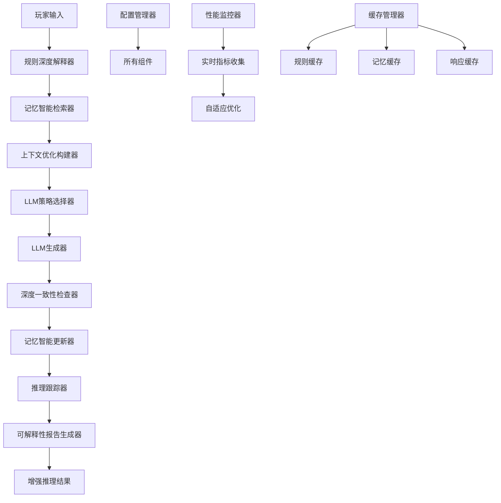
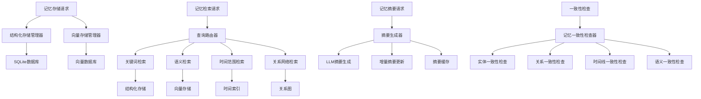
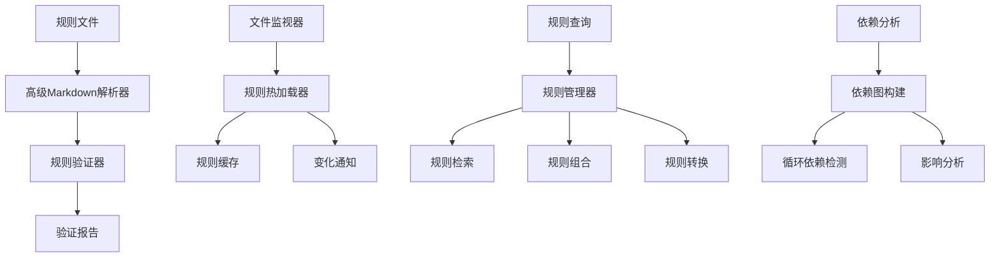

# AI-LOOM 第二阶段技术架构设计

## 概述

本文档详细描述AI-LOOM项目第二阶段的技术架构设计，涵盖高级推理引擎、世界记忆系统、规则层增强、LLM Provider增强和性能监控五个核心模块。

## 1. 高级推理引擎架构设计

### 1.1 当前状态分析

当前推理引擎已实现基础功能：
- `ReasoningPipeline` 类支持基本推理流程
- `ConsistencyChecker` 提供简单的一致性检查
- 支持多Provider回退机制

### 1.2 增强设计目标

1. **多步骤推理管道**：实现更精细的推理步骤控制
2. **智能上下文构建**：动态优化提示组装
3. **深度一致性检查**：支持语义级一致性验证
4. **推理可解释性**：提供完整的推理跟踪和审计

### 1.3 架构设计

#### 1.3.1 多步骤推理管道增强

```python
class EnhancedReasoningPipeline(ReasoningPipeline):
    """增强版推理管道"""
    
    def __init__(self, config: Dict[str, Any]):
        super().__init__()
        self.config = config
        self.reasoning_steps = []
        self.context_builder = EnhancedContextBuilder(config)
        self.consistency_checker = EnhancedConsistencyChecker(config)
        self.reasoning_tracker = ReasoningTracker()
        
    async def process(self, context: ReasoningContext) -> ReasoningResult:
        """增强处理流程"""
        # 1. 规则深度解释
        interpretation = await self._deep_interpret_rules(context)
        
        # 2. 记忆智能检索
        memories = await self._intelligent_memory_retrieval(context)
        
        # 3. 上下文优化构建
        prompt = await self.context_builder.build_optimized(
            context, interpretation, memories
        )
        
        # 4. LLM生成（带策略选择）
        response = await self._strategic_llm_generation(prompt, context)
        
        # 5. 深度一致性检查
        consistency_report = await self.consistency_checker.deep_check(
            response, context, interpretation, memories
        )
        
        # 6. 记忆智能更新
        await self._intelligent_memory_update(context, response, consistency_report)
        
        # 7. 生成可解释性报告
        explainability_report = self.reasoning_tracker.generate_report()
        
        return EnhancedReasoningResult(
            narrative_response=response.content,
            reasoning_steps=self.reasoning_steps,
            consistency_report=consistency_report,
            explainability_report=explainability_report,
            metadata={
                "model": response.model,
                "confidence": self._calculate_confidence(consistency_report),
                "reasoning_time": self.reasoning_tracker.get_total_time()
            }
        )
```

#### 1.3.2 上下文构建器设计

```python
class EnhancedContextBuilder:
    """增强上下文构建器"""
    
    def __init__(self, config: Dict[str, Any]):
        self.config = config
        self.token_optimizer = TokenOptimizer(config)
        self.context_selector = ContextSelector(config)
        self.prompt_template_manager = PromptTemplateManager()
        
    async def build_optimized(self, context: ReasoningContext, 
                             interpretation: InterpretationResult,
                             memories: List[MemoryEntity]) -> str:
        """构建优化提示"""
        # 1. 选择最相关的记忆
        relevant_memories = await self.context_selector.select_relevant(
            context, memories, limit=5
        )
        
        # 2. 提取关键约束
        key_constraints = self._extract_key_constraints(interpretation)
        
        # 3. 选择最佳模板
        template = self.prompt_template_manager.select_template(
            context, interpretation, relevant_memories
        )
        
        # 4. 组装提示
        prompt = template.render(
            rules=context.rules_text,
            constraints=key_constraints,
            memories=relevant_memories,
            player_input=context.player_input,
            interventions=context.interventions
        )
        
        # 5. 令牌优化
        optimized_prompt = await self.token_optimizer.optimize(prompt)
        
        return optimized_prompt
```

#### 1.3.3 深度一致性检查器

```python
class EnhancedConsistencyChecker(ConsistencyChecker):
    """增强一致性检查器"""
    
    async def deep_check(self, response: LLMResponse, context: ReasoningContext,
                        interpretation: InterpretationResult,
                        memories: List[MemoryEntity]) -> DeepConsistencyReport:
        """深度一致性检查"""
        issues = []
        
        # 1. 规则语义一致性检查
        rule_issues = await self._check_semantic_rule_violations(
            response, interpretation.constraints
        )
        issues.extend(rule_issues)
        
        # 2. 记忆语义一致性检查
        memory_issues = await self._check_semantic_memory_consistency(
            response, memories
        )
        issues.extend(memory_issues)
        
        # 3. 叙事逻辑一致性检查
        narrative_issues = await self._check_narrative_logic(
            response, context, memories
        )
        issues.extend(narrative_issues)
        
        # 4. 风格基调一致性检查
        style_issues = await self._check_style_consistency(
            response, context.rules_text
        )
        issues.extend(style_issues)
        
        # 5. 使用LLM进行深度语义检查
        llm_issues = await self._check_with_llm(
            response, context, interpretation, memories
        )
        issues.extend(llm_issues)
        
        return DeepConsistencyReport(
            issues=issues,
            overall_score=self._calculate_overall_score(issues),
            category_scores=self._calculate_category_scores(issues),
            suggestions=self._generate_correction_suggestions(issues, response)
        )
```

#### 1.3.4 推理跟踪器

```python
class ReasoningTracker:
    """推理跟踪器"""
    
    def __init__(self):
        self.steps = []
        self.start_time = None
        self.metrics = {}
        
    def start_step(self, step_name: str, metadata: Dict[str, Any] = None):
        """开始推理步骤"""
        step = {
            "name": step_name,
            "start_time": time.time(),
            "metadata": metadata or {},
            "substeps": []
        }
        self.steps.append(step)
        
    def end_step(self, step_name: str, result: Any = None, metrics: Dict[str, Any] = None):
        """结束推理步骤"""
        for step in reversed(self.steps):
            if step["name"] == step_name:
                step["end_time"] = time.time()
                step["duration"] = step["end_time"] - step["start_time"]
                step["result"] = result
                step["metrics"] = metrics or {}
                break
                
    def add_substep(self, parent_step: str, substep_name: str, details: Dict[str, Any]):
        """添加子步骤"""
        for step in self.steps:
            if step["name"] == parent_step:
                step["substeps"].append({
                    "name": substep_name,
                    "details": details,
                    "timestamp": time.time()
                })
                break
                
    def generate_report(self) -> Dict[str, Any]:
        """生成可解释性报告"""
        total_time = sum(step.get("duration", 0) for step in self.steps)
        
        return {
            "steps": self.steps,
            "total_time": total_time,
            "step_breakdown": [
                {
                    "name": step["name"],
                    "duration": step.get("duration", 0),
                    "percentage": (step.get("duration", 0) / total_time * 100) if total_time > 0 else 0
                }
                for step in self.steps
            ],
            "key_decisions": self._extract_key_decisions(),
            "confidence_factors": self._calculate_confidence_factors()
        }
```

### 1.4 接口设计

#### 1.4.1 增强推理上下文

```python
@dataclass
class EnhancedReasoningContext(ReasoningContext):
    """增强推理上下文"""
    reasoning_strategy: str = "balanced"  # balanced, creative, conservative
    explainability_level: str = "detailed"  # minimal, standard, detailed
    memory_retrieval_strategy: str = "recent_relevant"  # recent, relevant, important
    constraint_priority: List[str] = field(default_factory=lambda: ["permission", "causality", "style"])
    llm_generation_strategy: Dict[str, Any] = field(default_factory=dict)
```

#### 1.4.2 增强推理结果

```python
@dataclass
class EnhancedReasoningResult(ReasoningResult):
    """增强推理结果"""
    consistency_report: DeepConsistencyReport
    explainability_report: Dict[str, Any]
    reasoning_strategy_used: str
    memory_retrieval_stats: Dict[str, Any]
    constraint_application_stats: Dict[str, Any]
    llm_generation_stats: Dict[str, Any]
    
    def to_visualization_data(self) -> Dict[str, Any]:
        """转换为可视化数据"""
        return {
            "reasoning_path": self._extract_reasoning_path(),
            "constraint_application": self._format_constraint_application(),
            "memory_usage": self._format_memory_usage(),
            "consistency_issues": self._format_consistency_issues(),
            "performance_metrics": self._extract_performance_metrics()
        }
```

### 1.5 数据流设计



### 1.6 实现策略

#### 阶段1：基础增强（2天）
1. 实现`EnhancedContextBuilder`基础功能
2. 增强`ConsistencyChecker`语义检查
3. 添加`ReasoningTracker`基础跟踪

#### 阶段2：智能优化（1.5天）
1. 实现智能记忆检索策略
2. 添加提示模板管理系统
3. 实现令牌优化器

#### 阶段3：可解释性（0.5天）
1. 完善推理跟踪报告
2. 添加可视化数据生成
3. 实现调试接口

## 2. 世界记忆系统架构设计

### 2.1 当前状态分析

当前记忆系统已实现：
- `WorldMemory`基础内存管理
- `StructuredStore`SQLite存储
- 基础实体和关系管理

### 2.2 增强设计目标

1. **向量存储集成**：支持语义相似性检索
2. **记忆摘要生成**：自动生成记忆摘要
3. **复杂查询支持**：支持时间范围、关系网络查询
4. **记忆一致性维护**：确保记忆间的一致性

### 2.3 架构设计

#### 2.3.1 向量存储集成

```python
class VectorMemoryStore:
    """向量记忆存储"""
    
    def __init__(self, config: Dict[str, Any]):
        self.config = config
        self.embedding_model = self._load_embedding_model(config)
        self.vector_db = self._initialize_vector_db(config)
        
    async def store_entity_with_embedding(self, entity: MemoryEntity) -> bool:
        """存储实体及其向量嵌入"""
        # 生成文本表示
        text_representation = self._entity_to_text(entity)
        
        # 生成嵌入向量
        embedding = await self.embedding_model.embed(text_representation)
        
        # 存储到向量数据库
        await self.vector_db.add(
            id=entity.id,
            embedding=embedding,
            metadata={
                "session_id": entity.session_id,
                "type": entity.type.value,
                "content_summary": self._summarize_content(entity.content),
                "timestamp": entity.updated_at.isoformat()
            }
        )
        
        return True
        
    async def semantic_search(self, query: str, filters: Dict[str, Any] = None, 
                            limit: int = 10) -> List[Tuple[str, float]]:
        """语义相似性搜索"""
        # 生成查询嵌入
        query_embedding = await self.embedding_model.embed(query)
        
        # 在向量数据库中搜索
        results = await self.vector_db.search(
            query_embedding=query_embedding,
            filters=filters,
            limit=limit
        )
        
        return results
```

#### 2.3.2 记忆摘要生成器

```python
class MemorySummarizer:
    """记忆摘要生成器"""
    
    def __init__(self, config: Dict[str, Any]):
        self.config = config
        self.llm_provider = LLMProvider(config.get("llm_config", {}))
        self.summary_cache = {}
        
    async def generate_summary(self, entities: List[MemoryEntity], 
                              summary_type: str = "narrative") -> str:
        """生成记忆摘要"""
        cache_key = self._generate_cache_key(entities, summary_type)
        
        # 检查缓存
        if cache_key in self.summary_cache:
            return self.summary_cache[cache_key]
        
        # 准备摘要提示
        prompt = self._build_summary_prompt(entities, summary_type)
        
        # 使用LLM生成摘要
        response = await self.llm_provider.generate(prompt)
        
        # 缓存结果
        self.summary_cache[cache_key] = response.content
        
        # 限制缓存大小
        if len(self.summary_cache) > 100:
            self._evict_oldest_cache()
            
        return response.content
        
    async def generate_incremental_summary(self, new_entities: List[MemoryEntity],
                                         previous_summary: str) -> str:
        """生成增量摘要"""
        prompt = f"""
        基于以下已有摘要和新增记忆，生成更新后的摘要：
        
        已有摘要：
        {previous_summary}
        
        新增记忆：
        {self._format_entities_for_summary(new_entities)}
        
        请生成更新后的完整摘要，保持连贯性和一致性。
        """
        
        response = await self.llm_provider.generate(prompt)
        return response.content
```

#### 2.3.3 增强世界记忆接口

```python
class EnhancedWorldMemory(WorldMemory):
    """增强世界记忆"""
    
    def __init__(self, session_id: str, config: Dict[str, Any]):
        super().__init__(session_id)
        self.config = config
        self.vector_store = VectorMemoryStore(config.get("vector_store_config", {}))
        self.summarizer = MemorySummarizer(config.get("summarizer_config", {}))
        self.consistency_checker = MemoryConsistencyChecker(config)
        
    async def semantic_search(self, query: str, filters: Dict[str, Any] = None,
                            limit: int = 10) -> List[MemoryEntity]:
        """语义搜索"""
        # 使用向量存储进行语义搜索
        vector_results = await self.vector_store.semantic_search(query, filters, limit)
        
        # 检索完整实体
        entities = []
        for entity_id, score in vector_results:
            entity = await self.retrieve_entity(entity_id)
            if entity:
                entities.append((entity, score))
                
        # 按相关性排序
        entities.sort(key=lambda x: x[1], reverse=True)
        
        return [entity for entity, score in entities[:limit]]
        
    async def get_timeline(self, start_time: datetime = None,
                          end_time: datetime = None) -> List[Dict[str, Any]]:
        """获取时间线"""
        # 查询时间范围内的事件和事实
        timeline_events = await self._query_timeline_events(start_time, end_time)
        
        # 按时间排序
        timeline_events.sort(key=lambda x: x.get("timestamp"))
        
        return timeline_events
        
    async def get_relationship_network(self, entity_id: str, depth: int = 2) -> Dict[str, Any]:
        """获取关系网络"""
        network = {
            "central_entity": entity_id,
            "nodes": {},
            "edges": []
        }
        
        # 广度优先搜索关系
        await self._bfs_relationship_search(entity_id, depth, network)
        
        return network
```

### 2.4 数据模型增强

#### 2.4.1 增强记忆实体

```python
@dataclass
class EnhancedMemoryEntity(MemoryEntity):
    """增强记忆实体"""
    embedding: Optional[List[float]] = None
    importance_score: float = 0.5  # 0-1的重要性评分
    summary: Optional[str] = None
    tags: List[str] = field(default_factory=list)
    temporal_metadata: Dict[str, Any] = field(default_factory=dict)
    
    def to_vector_text(self) -> str:
        """转换为向量文本表示"""
        parts = []
        
        # 实体类型
        parts.append(f"类型：{self.type.value}")
        
        # 关键内容
        if "name" in self.content:
            parts.append(f"名称：{self.content['name']}")
        if "description" in self.content:
            parts.append(f"描述：{self.content['description'][:200]}")
        if "traits" in self.content and isinstance(self.content["traits"], list):
            parts.append(f"特征：{', '.join(self.content['traits'][:5])}")
        
        # 元数据
        if self.tags:
            parts.append(f"标签：{', '.join(self.tags)}")
        
        return " | ".join(parts)

#### 2.4.2 增强记忆关系

```python
@dataclass
class EnhancedMemoryRelation(MemoryRelation):
    """增强记忆关系"""
    temporal_validity: Optional[Dict[str, datetime]] = None  # 时间有效性
    confidence: float = 1.0  # 关系置信度
    evidence: List[str] = field(default_factory=list)  # 关系证据
    metadata_schema: Dict[str, Any] = field(default_factory=dict)  # 元数据模式
    
    def is_valid_at(self, timestamp: datetime) -> bool:
        """检查关系在指定时间是否有效"""
        if not self.temporal_validity:
            return True
        
        start = self.temporal_validity.get("start")
        end = self.temporal_validity.get("end")
        
        if start and timestamp < start:
            return False
        if end and timestamp > end:
            return False
        
        return True
```

### 2.5 记忆一致性检查器

```python
class MemoryConsistencyChecker:
    """记忆一致性检查器"""
    
    def __init__(self, config: Dict[str, Any]):
        self.config = config
        self.llm_provider = LLMProvider(config.get("llm_config", {}))
        
    async def check_consistency(self, entities: List[MemoryEntity], 
                               relations: List[MemoryRelation]) -> Dict[str, Any]:
        """检查记忆一致性"""
        issues = []
        
        # 1. 检查实体间的一致性
        entity_issues = await self._check_entity_consistency(entities)
        issues.extend(entity_issues)
        
        # 2. 检查关系的一致性
        relation_issues = await self._check_relation_consistency(relations, entities)
        issues.extend(relation_issues)
        
        # 3. 检查时间线一致性
        timeline_issues = await self._check_timeline_consistency(entities, relations)
        issues.extend(timeline_issues)
        
        # 4. 使用LLM进行语义一致性检查
        semantic_issues = await self._check_semantic_consistency(entities, relations)
        issues.extend(semantic_issues)
        
        return {
            "issues": issues,
            "consistency_score": self._calculate_consistency_score(issues),
            "suggestions": self._generate_consistency_suggestions(issues)
        }
    
    async def _check_semantic_consistency(self, entities: List[MemoryEntity],
                                         relations: List[MemoryRelation]) -> List[Dict[str, Any]]:
        """检查语义一致性"""
        # 准备记忆描述
        memory_description = self._format_memory_for_consistency_check(entities, relations)
        
        prompt = f"""
        请检查以下记忆集合中的语义一致性：
        
        {memory_description}
        
        请找出以下问题：
        1. 矛盾的事实描述
        2. 不一致的角色特征
        3. 逻辑冲突的事件顺序
        4. 不合理的关系网络
        
        请以JSON格式返回发现的问题。
        """
        
        response = await self.llm_provider.generate(prompt)
        
        try:
            issues = json.loads(response.content)
            return issues
        except:
            return []
```

### 2.6 数据流设计



### 2.7 实现策略

#### 阶段1：向量存储集成（2天）
1. 实现`VectorMemoryStore`基础功能
2. 集成嵌入模型（如sentence-transformers）
3. 配置向量数据库（ChromaDB或Qdrant）

#### 阶段2：记忆摘要生成（1.5天）
1. 实现`MemorySummarizer`基础功能
2. 添加摘要缓存机制
3. 实现增量摘要更新

#### 阶段3：复杂查询支持（1天）
1. 实现时间线查询
2. 实现关系网络查询
3. 添加查询优化器

#### 阶段4：一致性维护（0.5天）
1. 实现`MemoryConsistencyChecker`
2. 添加自动一致性修复建议
3. 实现记忆验证接口

## 3. 规则层增强架构设计

### 3.1 当前状态分析

当前规则层已实现：
- `MarkdownCanon`基础Markdown解析
- 规则章节管理和验证
- 基础实体提取功能

### 3.2 增强设计目标

1. **高级Markdown解析**：支持嵌套章节、交叉引用
2. **规则验证器**：静态分析规则一致性
3. **规则热加载**：支持运行时规则更新
4. **规则依赖分析**：分析规则间依赖关系

### 3.3 架构设计

#### 3.3.1 高级Markdown解析器

```python
class AdvancedMarkdownCanon(MarkdownCanon):
    """高级Markdown规则解析器"""
    
    def __init__(self, path: Path, raw_content: str = ""):
        super().__init__(path, raw_content)
        self.references = {}  # 交叉引用
        self.dependencies = []  # 规则依赖
        self.validation_errors = []  # 验证错误
        
    def _parse_content(self):
        """增强解析内容"""
        super()._parse_content()
        
        # 提取交叉引用
        self._extract_references()
        
        # 分析依赖关系
        self._analyze_dependencies()
        
        # 验证规则结构
        self._validate_structure()
    
    def _extract_references(self):
        """提取交叉引用"""
        for section_name, section in self.sections.items():
            # 查找引用模式 [@reference]
            references = re.findall(r'\[@([^\]]+)\]', section.content)
            for ref in references:
                self.references.setdefault(section_name, []).append(ref)
    
    def _analyze_dependencies(self):
        """分析依赖关系"""
        # 分析章节间的依赖
        for source, targets in self.references.items():
            for target in targets:
                self.dependencies.append({
                    "source": source,
                    "target": target,
                    "type": "reference"
                })
        
        # 分析元数据依赖
        if "requires" in self.metadata:
            requirements = self.metadata["requires"]
            if isinstance(requirements, list):
                for req in requirements:
                    self.dependencies.append({
                        "source": self.path.name,
                        "target": req,
                        "type": "metadata"
                    })
    
    def get_referenced_sections(self, section_name: str) -> List[str]:
        """获取引用的章节"""
        return self.references.get(section_name, [])
    
    def get_dependent_sections(self, section_name: str) -> List[str]:
        """获取依赖的章节"""
        return [
            dep["source"] for dep in self.dependencies 
            if dep["target"] == section_name
        ]
    
    def validate_with_schema(self, schema: Dict[str, Any]) -> List[str]:
        """使用模式验证"""
        errors = super().validate_with_schema(schema)
        
        # 检查交叉引用有效性
        for section_name, refs in self.references.items():
            for ref in refs:
                if ref not in self.sections:
                    errors.append(f"Section '{section_name}' references non-existent section '{ref}'")
        
        # 检查循环依赖
        if self._has_circular_dependencies():
            errors.append("Circular dependencies detected in rules")
        
        return errors
```

#### 3.3.2 规则验证器

```python
class RuleValidator:
    """规则验证器"""
    
    def __init__(self, config: Dict[str, Any]):
        self.config = config
        self.validation_rules = self._load_validation_rules(config)
        self.llm_provider = LLMProvider(config.get("llm_config", {}))
    
    async def validate(self, canon: MarkdownCanon) -> ValidationReport:
        """验证规则"""
        issues = []
        
        # 1. 结构验证
        structure_issues = self._validate_structure(canon)
        issues.extend(structure_issues)
        
        # 2. 语义验证
        semantic_issues = await self._validate_semantics(canon)
        issues.extend(semantic_issues)
        
        # 3. 一致性验证
        consistency_issues = await self._validate_consistency(canon)
        issues.extend(consistency_issues)
        
        # 4. 完整性验证
        completeness_issues = self._validate_completeness(canon)
        issues.extend(completeness_issues)
        
        return ValidationReport(
            canon_path=canon.path,
            issues=issues,
            severity_counts=self._count_issues_by_severity(issues),
            validation_score=self._calculate_validation_score(issues),
            suggestions=self._generate_validation_suggestions(issues)
        )
    
    async def _validate_semantics(self, canon: MarkdownCanon) -> List[ValidationIssue]:
        """验证语义"""
        issues = []
        
        # 使用LLM验证语义合理性
        for section_name, section in canon.sections.items():
            prompt = f"""
            请验证以下规则章节的语义合理性：
            
            章节名称：{section_name}
            章节类型：{section.section_type.value}
            内容：
            {section.content[:1000]}
            
            请检查以下问题：
            1. 逻辑矛盾
            2. 模糊不清的描述
            3. 不合理的约束
            4. 缺失的必要信息
            
            请以JSON格式返回发现的问题。
            """
            
            response = await self.llm_provider.generate(prompt)
            
            try:
                semantic_issues = json.loads(response.content)
                for issue in semantic_issues:
                    issues.append(ValidationIssue(
                        type="semantic",
                        severity=issue.get("severity", "medium"),
                        description=issue.get("description", ""),
                        location=f"section:{section_name}",
                        suggestion=issue.get("suggestion", "")
                    ))
            except:
                pass
        
        return issues
```

#### 3.3.3 规则热加载器

```python
class RuleHotLoader:
    """规则热加载器"""
    
    def __init__(self, config: Dict[str, Any]):
        self.config = config
        self.watched_paths = set()
        self.file_watchers = {}
        self.callbacks = []
        self.canon_cache = {}
        
    def watch(self, path: Path, recursive: bool = True):
        """监视规则文件变化"""
        if str(path) in self.watched_paths:
            return
        
        self.watched_paths.add(str(path))
        
        # 创建文件监视器
        watcher = FileWatcher(path, recursive=recursive)
        watcher.on_change(self._handle_file_change)
        self.file_watchers[str(path)] = watcher
        
        logger.info(f"Started watching rules at {path}")
    
    def _handle_file_change(self, changed_file: Path, change_type: str):
        """处理文件变化"""
        logger.info(f"Rule file changed: {changed_file} ({change_type})")
        
        # 重新加载规则
        try:
            canon = self._load_canon(changed_file)
            self.canon_cache[str(changed_file)] = canon
            
            # 通知回调
            for callback in self.callbacks:
                callback(changed_file, canon, change_type)
                
        except Exception as e:
            logger.error(f"Failed to reload rule file {changed_file}: {e}")
    
    def register_callback(self, callback: Callable):
        """注册变化回调"""
        self.callbacks.append(callback)
    
    def get_canon(self, path: Path) -> Optional[MarkdownCanon]:
        """获取规则（带缓存）"""
        cache_key = str(path)
        
        if cache_key in self.canon_cache:
            return self.canon_cache[cache_key]
        
        try:
            canon = self._load_canon(path)
            self.canon_cache[cache_key] = canon
            return canon
        except Exception as e:
            logger.error(f"Failed to load canon {path}: {e}")
            return None
    
    def _load_canon(self, path: Path) -> MarkdownCanon:
        """加载规则"""
        with open(path, 'r', encoding='utf-8') as f:
            content = f.read()
        
        return AdvancedMarkdownCanon(path, content)
```

### 3.4 数据模型增强

#### 3.4.1 验证问题

```python
@dataclass
class ValidationIssue:
    """验证问题"""
    type: str  # structure, semantic, consistency, completeness
    severity: str  # low, medium, high, critical
    description: str
    location: str  # section:name, line:number, etc.
    suggestion: Optional[str] = None
    metadata: Dict[str, Any] = field(default_factory=dict)
```

#### 3.4.2 验证报告

```python
@dataclass
class ValidationReport:
    """验证报告"""
    canon_path: Path
    issues: List[ValidationIssue]
    severity_counts: Dict[str, int]
    validation_score: float  # 0-1
    suggestions: List[str]
    timestamp: datetime = field(default_factory=datetime.now)
    
    def to_dict(self) -> Dict[str, Any]:
        """转换为字典"""
        return {
            "canon_path": str(self.canon_path),
            "issue_count": len(self.issues),
            "severity_counts": self.severity_counts,
            "validation_score": self.validation_score,
            "suggestions": self.suggestions,
            "timestamp": self.timestamp.isoformat(),
            "issues": [
                {
                    "type": issue.type,
                    "severity": issue.severity,
                    "description": issue.description,
                    "location": issue.location,
                    "suggestion": issue.suggestion
                }
                for issue in self.issues
            ]
        }
```

### 3.5 数据流设计



### 3.6 实现策略

#### 阶段1：高级解析（1.5天）
1. 实现`AdvancedMarkdownCanon`交叉引用支持
2. 添加依赖关系分析
3. 实现结构验证增强

#### 阶段2：规则验证（1天）
1. 实现`RuleValidator`基础验证
2. 添加语义验证（使用LLM）
3. 实现验证报告生成

#### 阶段3：热加载支持（0.5天）
1. 实现`RuleHotLoader`文件监视
2. 添加规则缓存机制
3. 实现变化通知系统

#### 阶段4：工具集成（1天）
1. 实现规则编辑辅助工具
2. 添加验证CLI命令
3. 实现规则可视化工具

## 4. LLM Provider增强架构设计

### 4.1 当前状态分析

当前LLM Provider已实现：
- `LLMProvider`抽象基类
- `OpenAIProvider`和`AnthropicProvider`实现
- 基础重试和缓存机制

### 4.2 增强设计目标

1. **多Provider故障转移**：智能故障转移和负载均衡
2. **成本优化**：跟踪和优化LLM使用成本
3. **本地模型支持**：集成Ollama、LM Studio等本地模型
4. **性能监控**：实时监控Provider性能

### 4.3 架构设计

#### 4.3.1 Provider管理器增强

```python
class EnhancedProviderManager(ProviderManager):
    """增强Provider
    importance_score: float = 0.5  # 0-1的重要性评分
    summary: Optional[str] = None
    tags: List[str] = field(default_factory=list)
    temporal_metadata: Dict[str, Any] = field(default_factory=dict)
    
    def to_vector_text(self) -> str:
        """转换为向量文本表示"""
        parts = []
        
        # 实体类型
        parts.append(f"类型：{self.type.value}")
        
        # 关键内容
        if "name" in self.content:
            parts.append(f"名称：{self.content['name']}")
        if "description" in self.content:
            parts.append