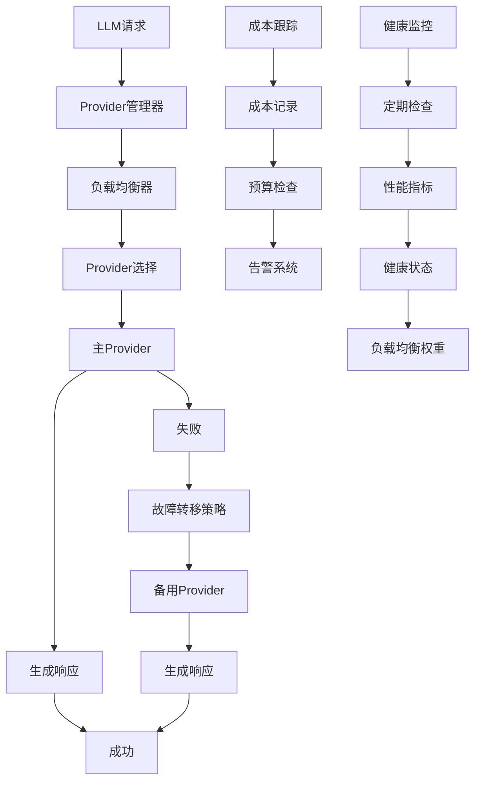

# AI-LOOM 第二阶段技术架构设计（续）

## 4. LLM Provider增强架构设计（续）

### 4.3 架构设计（续）

#### 4.3.1 Provider管理器增强（续）

```python
class EnhancedProviderManager(ProviderManager):
    """增强Provider管理器"""
    
    def __init__(self, config: Dict[str, Any]):
        super().__init__()
        self.config = config
        self.providers = {}
        self.health_monitor = ProviderHealthMonitor(config)
        self.load_balancer = ProviderLoadBalancer(config)
        self.cost_tracker = CostTracker(config)
        self.fallback_strategy = FallbackStrategy(config)
        
    async def register_provider(self, name: str, provider: LLMProvider):
        """注册Provider"""
        await super().register_provider(name, provider)
        
        # 启动健康监控
        await self.health_monitor.monitor_provider(name, provider)
        
        # 更新负载均衡器
        self.load_balancer.add_provider(name, provider)
        
        logger.info(f"Registered enhanced provider: {name}")
    
    async def generate_with_intelligent_fallback(self, prompt: str, **kwargs) -> LLMResponse:
        """智能故障转移生成"""
        # 1. 选择最佳Provider
        selected_provider = await self.load_balancer.select_provider(
            prompt, kwargs.get("model"), kwargs.get("priority", "balanced")
        )
        
        # 2. 尝试生成
        try:
            response = await self.providers[selected_provider].generate(prompt, **kwargs)
            
            # 更新性能统计
            await self.health_monitor.record_success(selected_provider, response)
            self.cost_tracker.record_usage(selected_provider, response)
            
            return response
            
        except Exception as e:
            # 3. 记录失败
            await self.health_monitor.record_failure(selected_provider, str(e))
            
            # 4. 执行故障转移
            fallback_provider = await self.fallback_strategy.get_fallback(
                selected_provider, e, prompt, kwargs
            )
            
            if fallback_provider and fallback_provider != selected_provider:
                logger.warning(f"Falling back from {selected_provider} to {fallback_provider}")
                return await self.providers[fallback_provider].generate(prompt, **kwargs)
            
            # 5. 如果所有Provider都失败，返回降级响应
            logger.error(f"All providers failed for prompt: {prompt[:100]}...")
            return await self._generate_degraded_response(prompt, **kwargs)
    
    async def get_provider_stats(self) -> Dict[str, Any]:
        """获取Provider统计"""
        stats = {
            "providers": {},
            "overall": {
                "total_requests": 0,
                "total_tokens": 0,
                "total_cost": 0.0,
                "success_rate": 0.0
            }
        }
        
        for name, provider in self.providers.items():
            provider_stats = provider.get_stats()
            health = await self.health_monitor.get_provider_health(name)
            cost = self.cost_tracker.get_provider_cost(name)
            
            stats["providers"][name] = {
                **provider_stats,
                "health": health,
                "cost": cost,
                "load_balancing_weight": self.load_balancer.get_weight(name)
            }
            
            # 更新总体统计
            stats["overall"]["total_requests"] += provider_stats["request_count"]
            stats["overall"]["total_tokens"] += provider_stats["total_tokens"]
            stats["overall"]["total_cost"] += cost["total_cost"]
        
        # 计算总体成功率
        total_success = sum(
            1 for provider_stats in stats["providers"].values()
            if provider_stats["health"].get("healthy", False)
        )
        stats["overall"]["success_rate"] = total_success / len(self.providers) if self.providers else 0
        
        return stats
```

#### 4.3.2 成本优化器

```python
class CostOptimizer:
    """成本优化器"""
    
    def __init__(self, config: Dict[str, Any]):
        self.config = config
        self.budget = config.get("budget", 100.0)  # 默认预算100美元
        self.daily_limit = config.get("daily_limit", 10.0)  # 每日限制10美元
        self.cost_history = []
        self.alerts_sent = set()
        
    def record_usage(self, provider_name: str, response: LLMResponse) -> float:
        """记录使用成本"""
        cost = self._calculate_cost(provider_name, response)
        
        # 添加到历史记录
        self.cost_history.append({
            "timestamp": datetime.now().isoformat(),
            "provider": provider_name,
            "model": response.model,
            "cost": cost,
            "tokens": response.usage.get("total_tokens", 0) if response.usage else 0
        })
        
        # 检查预算限制
        self._check_budget_limits()
        
        return cost
    
    def _calculate_cost(self, provider_name: str, response: LLMResponse) -> float:
        """计算成本"""
        # 基于Provider和模型的定价
        pricing = self.config.get("pricing", {})
        
        if provider_name in pricing:
            provider_pricing = pricing[provider_name]
            model = response.model
            
            # 查找模型定价
            for model_pattern, price in provider_pricing.items():
                if model_pattern in model:
                    input_tokens = response.usage.get("prompt_tokens", 0)
                    output_tokens = response.usage.get("completion_tokens", 0)
                    
                    input_cost = (input_tokens / 1000) * price.get("input", 0.001)
                    output_cost = (output_tokens / 1000) * price.get("output", 0.002)
                    
                    return input_cost + output_cost
        
        # 默认成本计算
        total_tokens = sum(response.usage.values()) if response.usage else 0
        return total_tokens / 1000 * 0.002
    
    def _check_budget_limits(self):
        """检查预算限制"""
        today = datetime.now().date()
        daily_cost = sum(
            item["cost"] for item in self.cost_history
            if datetime.fromisoformat(item["timestamp"]).date() == today
        )
        
        total_cost = sum(item["cost"] for item in self.cost_history)
        
        # 检查每日限制
        if daily_cost > self.daily_limit and "daily_limit" not in self.alerts_sent:
            logger.warning(f"Daily cost limit exceeded: {daily_cost:.2f} > {self.daily_limit:.2f}")
            self._send_alert("daily_limit", daily_cost, self.daily_limit)
            self.alerts_sent.add("daily_limit")
        
        # 检查总预算
        if total_cost > self.budget and "total_budget" not in self.alerts_sent:
            logger.warning(f"Total budget exceeded: {total_cost:.2f} > {self.budget:.2f}")
            self._send_alert("total_budget", total_cost, self.budget)
            self.alerts_sent.add("total_budget")
    
    def get_cost_summary(self) -> Dict[str, Any]:
        """获取成本摘要"""
        today = datetime.now().date()
        
        daily_items = [
            item for item in self.cost_history
            if datetime.fromisoformat(item["timestamp"]).date() == today
        ]
        
        return {
            "total_cost": sum(item["cost"] for item in self.cost_history),
            "daily_cost": sum(item["cost"] for item in daily_items),
            "total_tokens": sum(item.get("tokens", 0) for item in self.cost_history),
            "daily_tokens": sum(item.get("tokens", 0) for item in daily_items),
            "provider_breakdown": self._get_provider_breakdown(),
            "model_breakdown": self._get_model_breakdown(),
            "budget_status": {
                "budget": self.budget,
                "daily_limit": self.daily_limit,
                "remaining_budget": max(0, self.budget - sum(item["cost"] for item in self.cost_history)),
                "remaining_daily": max(0, self.daily_limit - sum(item["cost"] for item in daily_items))
            }
        }
```

#### 4.3.3 本地模型支持

```python
class LocalModelProvider(LLMProvider):
    """本地模型Provider"""
    
    def __init__(self, config: Dict[str, Any]):
        super().__init__(config)
        self.model_path = config.get("model_path")
        self.model_type = config.get("model_type", "ollama")  # ollama, lm_studio, vllm
        self.api_base = config.get("api_base", "http://localhost:11434")
        self.context_window = config.get("context_window", 4096)
        
        # 初始化本地模型连接
        self._initialize_local_connection()
    
    def _initialize_local_connection(self):
        """初始化本地连接"""
        if self.model_type == "ollama":
            self.client = OllamaClient(self.api_base)
        elif self.model_type == "lm_studio":
            self.client = LMStudioClient(self.api_base)
        elif self.model_type == "vllm":
            self.client = VLLMClient(self.api_base)
        else:
            raise ValueError(f"Unsupported local model type: {self.model_type}")
        
        logger.info(f"Initialized local model provider: {self.name} ({self.model_type})")
    
    async def _generate_impl(self, prompt: str, **kwargs) -> LLMResponse:
        """生成文本的具体实现"""
        try:
            if self.model_type == "ollama":
                response = await self.client.generate(
                    model=self.model,
                    prompt=prompt,
                    options={
                        "temperature": kwargs.get("temperature", 0.7),
                        "max_tokens": kwargs.get("max_tokens", 1000)
                    }
                )
                
                return LLMResponse(
                    content=response["response"],
                    model=self.model,
                    usage={
                        "prompt_tokens": len(prompt) // 4,  # 估算
                        "completion_tokens": len(response["response"]) // 4,
                        "total_tokens": (len(prompt) + len(response["response"])) // 4
                    },
                    metadata={
                        "provider": "ollama",
                        "model_family": response.get("model_family", "unknown"),
                        "total_duration": response.get("total_duration", 0)
                    }
                )
            
            elif self.model_type == "lm_studio":
                # LM Studio API调用
                response = await self.client.chat_completions(
                    model=self.model,
                    messages=[{"role": "user", "content": prompt}],
                    **kwargs
                )
                
                return LLMResponse(
                    content=response["choices"][0]["message"]["content"],
                    model=self.model,
                    usage=response.get("usage", {}),
                    metadata={"provider": "lm_studio"}
                )
            
            else:
                # 通用本地API
                response = await self.client.generate(prompt, **kwargs)
                return response
                
        except Exception as e:
            logger.error(f"Local model generation failed: {e}")
            raise
    
    def _calculate_cost(self, response: LLMResponse) -> float:
        """计算本地模型成本（通常为0）"""
        # 本地模型通常没有直接成本
        return 0.0
    
    async def health_check(self) -> Dict[str, Any]:
        """健康检查"""
        try:
            # 发送简单测试请求
            test_response = await self.generate("test", max_tokens=10)
            
            return {
                "healthy": True,
                "model_loaded": True,
                "provider": self.name,
                "type": self.model_type,
                "context_window": self.context_window
            }
        except Exception as e:
            return {
                "healthy": False,
                "error": str(e),
                "provider": self.name,
                "type": self.model_type
            }
```

### 4.4 数据模型增强

#### 4.4.1 Provider健康状态

```python
@dataclass
class ProviderHealth:
    """Provider健康状态"""
    provider_name: str
    healthy: bool
    last_check: datetime
    response_time_ms: float
    success_rate: float  # 最近10次请求的成功率
    error_count: int
    last_error: Optional[str] = None
    recommendations: List[str] = field(default_factory=list)
    
    def to_dict(self) -> Dict[str, Any]:
        """转换为字典"""
        return {
            "provider_name": self.provider_name,
            "healthy": self.healthy,
            "last_check": self.last_check.isoformat(),
            "response_time_ms": self.response_time_ms,
            "success_rate": self.success_rate,
            "error_count": self.error_count,
            "last_error": self.last_error,
            "recommendations": self.recommendations
        }
```

#### 4.4.2 成本记录

```python
@dataclass
class CostRecord:
    """成本记录"""
    id: str = field(default_factory=lambda: str(uuid.uuid4()))
    timestamp: datetime = field(default_factory=datetime.now)
    provider_name: str
    model: str
    cost: float
    tokens: int
    request_type: str = "generation"  # generation, embedding, etc.
    session_id: Optional[str] = None
    metadata: Dict[str, Any] = field(default_factory=dict)
```

### 4.5 数据流设计



### 4.6 实现策略

#### 阶段1：故障转移增强（1天）
1. 实现`EnhancedProviderManager`智能故障转移
2. 添加`ProviderHealthMonitor`健康监控
3. 实现`FallbackStrategy`故障转移策略

#### 阶段2：成本优化（1天）
1. 实现`CostOptimizer`成本跟踪
2. 添加预算限制和告警
3. 实现成本报告生成

#### 阶段3：本地模型支持（1天）
1. 实现`LocalModelProvider`基础功能
2. 集成Ollama和LM Studio
3. 添加本地模型健康检查

#### 阶段4：性能优化（1天）
1. 实现连接池优化
2. 添加请求批处理
3. 实现响应缓存增强

## 5. 性能监控架构设计

### 5.1 设计目标

1. **实时性能监控**：监控系统关键指标
2. **性能基准测试**：建立性能基线
3. **资源使用分析**：分析内存、CPU使用情况
4. **告警系统**：关键指标异常告警

### 5.2 架构设计

#### 5.2.1 性能监控器

```python
class PerformanceMonitor:
    """性能监控器"""
    
    def __init__(self, config: Dict[str, Any]):
        self.config = config
        self.metrics_store = MetricsStore(config)
        self.alert_manager = AlertManager(config)
        self.benchmark_runner = BenchmarkRunner(config)
        
        # 注册指标收集器
        self.collectors = [
            SystemMetricsCollector(config),
            LLMMetricsCollector(config),
            MemoryMetricsCollector(config),
            SessionMetricsCollector(config)
        ]
        
        # 启动监控
        self._start_monitoring()
    
    def _start_monitoring(self):
        """启动监控"""
        for collector in self.collectors:
            collector.start_collecting(self._handle_metric)
        
        logger.info("Performance monitoring started")
    
    def _handle_metric(self, metric: Metric):
        """处理指标"""
        # 存储指标
        self.metrics_store.store(metric)
        
        # 检查告警条件
        alerts = self.alert_manager.check_metric(metric)
        for alert in alerts:
            self._handle_alert(alert)
    
    def _handle_alert(self, alert: Alert):
        """处理告警"""
        logger.warning(f"Performance alert: {alert.severity} - {alert.message}")
        
        # 发送告警通知
        self.alert_manager.send_alert(alert)
        
        # 记录告警
        self.metrics_store.store_alert(alert)
    
    async def run_benchmark(self, benchmark_name: str, config: Dict[str, Any] = None) -> BenchmarkResult:
        """运行性能基准测试"""
        return await self.benchmark_runner.run(benchmark_name, config or {})
    
    def get_metrics(self, metric_type: str = None, time_range: Tuple[datetime, datetime] = None) -> List[Metric]:
        """获取指标"""
        return self.metrics_store.query(metric_type, time_range)
    
    def get_performance_report(self, time_range: Tuple[datetime, datetime] = None) -> Dict[str, Any]:
        """获取性能报告"""
        metrics = self.get_metrics(time_range=time_range)
        
        report = {
            "time_range": {
                "start": time_range[0].isoformat() if time_range else None,
                "end": time_range[1].isoformat() if time