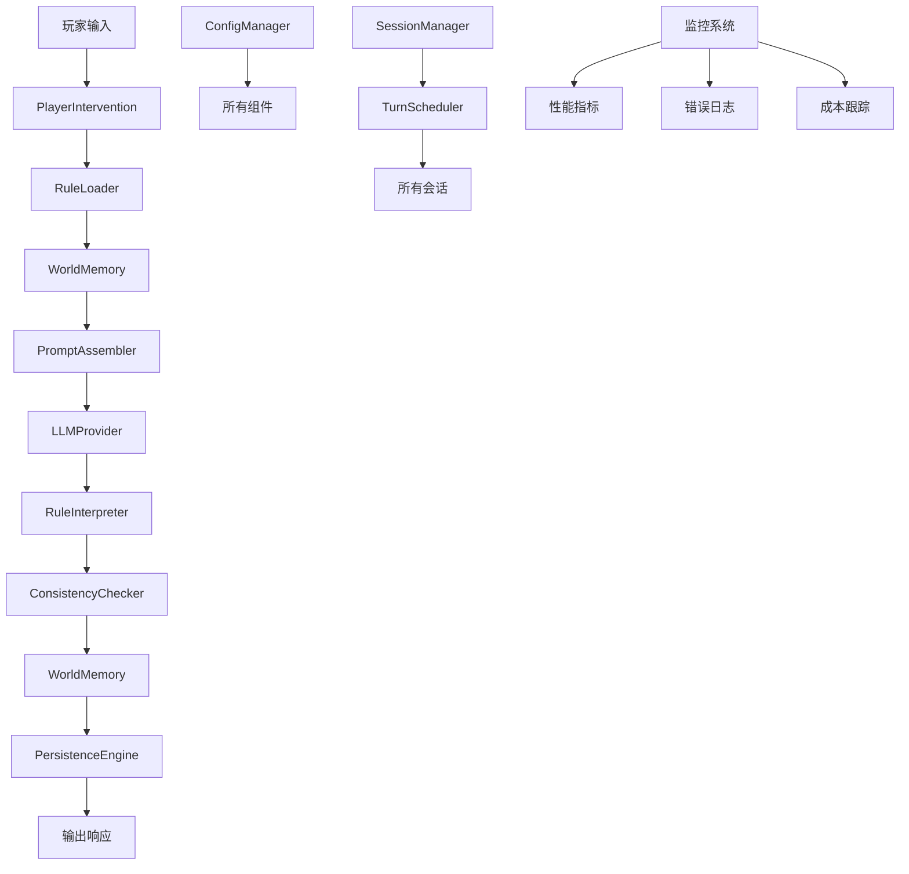

# LOOM 架构设计

## 概述

LOOM（Language-Oriented Open Mythos）是一个基于五层架构的语言驱动的开放叙事解释器运行时。其核心设计理念是"叙事失明"——解释器本身不解析规则内容，仅传递文本，由 LLM 在每回合重新解释规则。

## 五层架构

### 1. 运行时核心层 (Runtime Core)

**职责**: 生命周期管理、调度、持久化、Session管理、Prompt组装、Memory读写、回合调度、崩溃恢复。

**关键组件**:
- `SessionManager`: 会话生命周期管理
- `TurnScheduler`: 异步回合调度器
- `PersistenceEngine`: 持久化存储接口
- `PromptAssembler`: 动态组装Prompt
- `ConfigManager`: 配置加载与环境变量管理

**设计原则**:
- 保持叙事失明：不解析规则内容，仅传递文本
- 无状态设计：核心层不存储叙事状态
- 异步优先：所有I/O操作使用async/await
- 容错设计：自动错误恢复和状态回滚

**组件详细说明**:

#### SessionManager
- **功能**: 管理会话的创建、加载、保存和删除
- **特性**: 支持并发会话、会话快照、自动保存
- **接口**: `create_session()`, `load_session()`, `save_session()`, `delete_session()`

#### TurnScheduler
- **功能**: 管理异步回合队列，控制并发处理
- **特性**: 优先级队列、超时处理、负载均衡
- **接口**: `submit_turn()`, `get_turn_status()`, `cancel_turn()`

#### PersistenceEngine
- **功能**: 提供统一的持久化接口
- **特性**: 支持多种存储后端、事务支持、版本控制
- **接口**: `store()`, `retrieve()`, `delete()`, `query()`

#### PromptAssembler
- **功能**: 动态组装Prompt，支持模板系统
- **特性**: 上下文感知、变量替换、模板缓存
- **接口**: `assemble()`, `register_template()`, `clear_cache()`

#### ConfigManager
- **功能**: 管理应用配置和环境变量
- **特性**: 热重载、环境变量覆盖、配置验证
- **接口**: `get_config()`, `save_config()`, `reload()`

### 2. 规则层 (Markdown规则)

**职责**: 纯Markdown编写的世界观、叙事基调、冲突解决哲学等。

**文件结构**:
```
canon/
├── world.md          # 世界观与形而上学
├── tone.md           # 叙事基调与风格
├── conflict.md       # 冲突解决哲学
├── permissions.md    # 玩家权限边界
├── causality.md      # 死亡、时间、因果关系
└── meta.md           # 规则元信息（版本、作者等）
```

**规则特性**:
- 人类可读，LLM可解释
- 支持Markdown扩展语法（如`:::rule`自定义块）
- 版本控制通过Git管理
- 热加载：运行时监听文件变化
- 模块化：支持规则导入和组合

**组件详细说明**:

#### RuleLoader
- **功能**: 加载和解析Markdown规则文件
- **特性**: 文件监控、缓存、依赖解析
- **接口**: `load_canon()`, `get_all_canons()`, `watch_for_changes()`

#### MarkdownCanon
- **功能**: 表示解析后的规则集
- **特性**: 结构化访问、验证、序列化
- **接口**: `get_section()`, `validate()`, `to_dict()`

#### VersionControl
- **功能**: 管理规则版本和历史
- **特性**: Git集成、差异比较、回滚支持
- **接口**: `commit()`, `diff()`, `rollback()`

### 3. 解释层 (LLM推理)

**职责**: 每回合重新解释规则，推导符合规则的叙事结果。

**组件**:
- `RuleInterpreter`: 加载并解释Markdown规则
- `LLMProvider`: 抽象LLM提供商接口
- `ReasoningPipeline`: 推理流水线（理解→分析→推导→输出）
- `ConsistencyChecker`: 检查输出与规则/记忆一致性
- `PerformanceOptimizer`: 优化LLM调用性能

**工作流程**:
1. 加载当前规则集（完整Markdown）
2. 加载相关记忆摘要
3. 接收玩家输入（含干预意图）
4. 组装Prompt，调用LLM
5. 解析LLM响应，提取叙事结果
6. 更新记忆和状态

**组件详细说明**:

#### RuleInterpreter
- **功能**: 解释Markdown规则，提取约束和主题
- **特性**: 自然语言处理、约束提取、冲突检测
- **接口**: `interpret()`, `format_for_prompt()`, `detect_conflicts()`

#### LLMProvider
- **功能**: 抽象LLM提供商接口
- **特性**: 多提供商支持、流式响应、成本跟踪
- **接口**: `generate()`, `generate_stream()`, `get_cost_estimate()`

#### ReasoningPipeline
- **功能**: 实现完整的推理流程
- **特性**: 多阶段处理、错误恢复、质量评估
- **接口**: `process()`, `batch_process()`, `evaluate_quality()`

#### ConsistencyChecker
- **功能**: 检查输出与规则和记忆的一致性
- **特性**: 语义分析、矛盾检测、建议生成
- **接口**: `check()`, `suggest_corrections()`, `get_violations()`

### 4. 世界记忆层 (世界记忆)

**职责**: 结构化叙事状态存储（Canon事实、角色、剧情线、地点等）。

**数据结构**:
```python
# 记忆实体类型
MemoryEntity:
  - id: UUID
  - type: "character" | "location" | "fact" | "plotline" | "style"
  - content: JSON (结构化数据)
  - created_at: timestamp
  - updated_at: timestamp
  - version: int

# 记忆关系
MemoryRelation:
  - source_id: UUID
  - target_id: UUID
  - relation_type: "part_of" | "caused_by" | "located_at" | "related_to"
```

**存储方案**:
- 主存储：SQLite（关系型数据）
- 可选向量存储：Chroma/Qdrant（语义检索）
- 缓存层：Redis（可选，热数据）
- 备份存储：文件系统备份

**组件详细说明**:

#### WorldMemory
- **功能**: 管理结构化叙事状态存储
- **特性**: 实体关系管理、版本控制、查询优化
- **接口**: `store_entity()`, `retrieve_entity()`, `search_entities()`

#### StructuredStore
- **功能**: 提供结构化数据存储
- **特性**: SQL支持、索引优化、事务处理
- **接口**: `create_table()`, `insert()`, `select()`, `update()`

#### VectorStore
- **功能**: 提供向量相似性搜索
- **特性**: 语义检索、相似度计算、聚类分析
- **接口**: `add_vectors()`, `search_similar()`, `cluster()`

#### MemorySummarizer
- **功能**: 生成记忆摘要
- **特性**: 自动摘要、重要性评估、压缩优化
- **接口**: `generate_summary()`, `process_summarization()`

### 5. 玩家干预层 (玩家干预)

**职责**: 支持OOC注释、世界编辑、Retcon、基调调整等。

**干预类型**:
1. **OOC注释**: `(OOC: ...)` 格式，不影响叙事
2. **世界编辑**: `[EDIT: ...]` 直接修改世界状态
3. **Retcon**: `[RETCON: ...]` 追溯性修改历史
4. **基调调整**: `[TONE: ...]` 调整叙事风格
5. **意图声明**: `[INTENT: ...]` 声明玩家意图
6. **规则查询**: `[QUERY: ...]` 查询当前规则

**处理流程**:
```
玩家输入 → 干预解析器 → 意图识别 → 规则验证 → 吸收处理 → 状态更新
```

**组件详细说明**:

#### PlayerIntervention
- **功能**: 解析和处理玩家干预
- **特性**: 自然语言理解、意图识别、权限验证
- **接口**: `parse_input()`, `process_interventions()`, `validate_permission()`

#### WorldEditor
- **功能**: 处理玩家对世界状态的直接编辑
- **特性**: 编辑命令解析、状态变更、冲突解决
- **接口**: `parse_edit_command()`, `execute_edit()`, `validate_edit()`

#### RetconHandler
- **功能**: 处理追溯性修改
- **特性**: 时间线管理、一致性维护、版本控制
- **接口**: `parse_retcon_command()`, `execute_retcon()`, `rollback_to_version()`

#### OOCHandler
- **功能**: 处理OOC注释
- **特性**: 注释提取、意图分析、响应生成
- **接口**: `extract_ooc()`, `process_ooc()`, `generate_response()`

## 数据流设计

### 正常叙事流

```
玩家输入
    ↓
干预解析器 (PlayerIntervention)
    ↓
规则加载器 (RuleLoader)
    ↓
记忆检索器 (WorldMemory)
    ↓
Prompt组装器 (PromptAssembler)
    ↓
LLM调用 (LLMProvider)
    ↓
结果解析器 (RuleInterpreter)
    ↓
一致性检查 (ConsistencyChecker)
    ↓
记忆更新器 (WorldMemory)
    ↓
状态保存器 (PersistenceEngine)
    ↓
输出响应
```

### 错误处理流

```
异常发生
    ↓
错误分类器 (按类型分类)
    ↓
恢复策略选择
    ├── 重试策略 (可重试错误)
    ├── 降级策略 (部分功能不可用)
    ├── 回滚策略 (状态不一致)
    └── 终止策略 (严重错误)
    ↓
执行恢复操作
    ↓
日志记录 (结构化日志)
    ↓
用户通知 (友好错误信息)
```

### 性能优化流

```
请求到达
    ↓
缓存检查 (多层缓存)
    ├── 内存缓存 (热点数据)
    ├── Redis缓存 (会话数据)
    └── 本地缓存 (规则数据)
    ↓
并行处理 (适用时)
    ├── 规则加载 (异步)
    ├── 记忆检索 (异步)
    └── LLM调用 (异步)
    ↓
结果合并和验证
    ↓
响应返回
```

## 组件交互图



## 技术栈选型

### 编程语言和框架
- **语言**: Python 3.10+
- **异步框架**: asyncio + aiohttp
- **Web框架**: FastAPI（用于API服务）
- **CLI框架**: Typer
- **配置管理**: Pydantic Settings
- **测试框架**: pytest + hypothesis
- **文档生成**: mkdocs + mkdocstrings

### 数据库系统
- **主数据库**: SQLite（嵌入式，零配置）
- **分析数据库**: DuckDB（可选，用于复杂查询）
- **向量数据库**: Chroma（本地）或 Qdrant（云）
- **缓存**: Redis（可选，用于会话缓存）
- **消息队列**: Redis Streams（可选，用于异步处理）

### LLM接入方案
- **抽象层**: Provider无关设计
- **支持提供商**: OpenAI, Anthropic, 本地模型 (Llama, Phi via Ollama), Google Gemini, Azure OpenAI
- **BYOK设计**: 用户提供API密钥
- **成本控制**: 令牌计数、预算告警、使用限制
- **性能优化**: 请求批处理、响应缓存、连接池

### 监控和可观测性
- **日志系统**: structlog + JSON格式
- **指标收集**: Prometheus客户端
- **分布式追踪**: OpenTelemetry
- **错误跟踪**: Sentry（可选）
- **性能分析**: py-spy + memory-profiler

## 部署架构

### 本地运行模式
```
用户机器
├── LOOM CLI
├── SQLite数据库
├── 规则Markdown文件
└── 本地LLM（可选）
```

**要求**:
- Python 3.10+
- 磁盘空间：100MB+
- 内存：2GB+（使用本地LLM需更多）
- 网络：访问LLM API（如使用云端LLM）

### 服务器部署方案
```
负载均衡器 (Nginx/Traefik)
├── API服务 (FastAPI + Uvicorn)
├── 会话管理服务 (SessionManager)
├── 记忆存储服务 (WorldMemory)
├── LLM网关服务 (LLMProvider)
├── 规则仓库服务 (RuleLoader)
└── 监控服务 (Prometheus + Grafana)
```

**要求**:
- 容器化部署 (Docker/Kubernetes)
- 高可用配置
- 自动扩缩容
- 备份和恢复策略

### 容器化部署
```docker
# Docker Compose配置
version: '3.8'

services:
  api:
    image: loom-api:latest
    ports:
      - "8000:8000"
    environment:
      - DATABASE_URL=postgresql://user:pass@db:5432/loom
      - REDIS_URL=redis://redis:6379/0
    depends_on:
      - db
      - redis

  db:
    image: postgres:15
    environment:
      - POSTGRES_DB=loom
      - POSTGRES_USER=user
      - POSTGRES_PASSWORD=pass
    volumes:
      - postgres-data:/var/lib/postgresql/data

  redis:
    image: redis:7-alpine
    volumes:
      - redis-data:/data

  llm-gateway:
    image: loom-llm-gateway:latest
    environment:
      - OPENAI_API_KEY=${OPENAI_API_KEY}
      - ANTHROPIC_API_KEY=${ANTHROPIC_API_KEY}

  monitoring:
    image: grafana/grafana:latest
    ports:
      - "3000:3000"
    volumes:
      - grafana-data:/var/lib/grafana

volumes:
  postgres-data:
  redis-data:
  grafana-data:
```

## 扩展点设计

### 插件系统
```
plugins/
├── memory_backends/     # 记忆存储后端插件
├── llm_providers/      # LLM提供商插件
├── rule_validators/    # 规则验证器插件
├── intervention_types/ # 干预类型插件
├── prompt_templates/   # Prompt模板插件
└── export_formats/     # 导出格式插件
```

**插件接口**:
```python
class LoomPlugin:
    def initialize(config: Dict) -> None
    def get_capabilities() -> List[str]
    def get_config_schema() -> Dict[str, Any]
    def cleanup() -> None
```

### 自定义记忆后端
- **接口**: `MemoryBackend`抽象类
- **实现示例**: SQLiteBackend, PostgreSQLBackend, RedisBackend, MongoDBBackend
- **配置驱动**: 通过配置文件选择后端
- **特性**: 事务支持、索引优化、备份恢复

### 自定义LLM提供商
- **接口**: `LLMProvider`抽象类
- **实现示例**: OpenAIProvider, AnthropicProvider, OllamaProvider, HuggingFaceProvider
- **统一API**: 所有提供商实现相同接口
- **特性**: 流式响应、成本跟踪、错误处理

### 自定义规则验证器
- **接口**: `RuleValidator`抽象类
- **实现示例**: SyntaxValidator, ConsistencyValidator, StyleValidator
- **配置驱动**: 可组合的验证器链
- **特性**: 自定义规则、错误报告、自动修复

## 监控与可观测性

### 日志系统
- **结构化日志**: JSON格式，包含会话ID、回合号等上下文
- **日志级别**: DEBUG, INFO, WARNING, ERROR, CRITICAL
- **日志输出**: 文件 + 控制台 + 可选远程收集
- **日志轮转**: 按大小和时间自动轮转
- **日志查询**: 支持ELK栈或类似方案

### 指标收集
- **性能指标**: 回合延迟、LLM响应时间、记忆检索时间、队列长度
- **业务指标**: 活跃会话数、总回合数、干预次数、规则使用频率
- **成本指标**: LLM令牌使用量、API调用次数、估算成本
- **质量指标**: 规则解释一致性、记忆相关性、用户满意度
- **系统指标**: CPU使用率、内存使用、磁盘IO、网络流量

### 追踪系统
- **分布式追踪**: 每个请求分配唯一追踪ID
- **跨度记录**: 记录各层处理时间、错误信息、上下文数据
- **可视化**: Jaeger或Zipkin集成（可选）
- **性能分析**: 识别性能瓶颈和优化机会

### 健康检查
- **就绪检查**: 服务是否准备好接收请求
- **存活检查**: 服务是否仍在运行
- **依赖检查**: 检查数据库、缓存、LLM API等依赖
- **自定义
