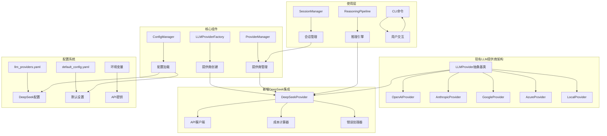
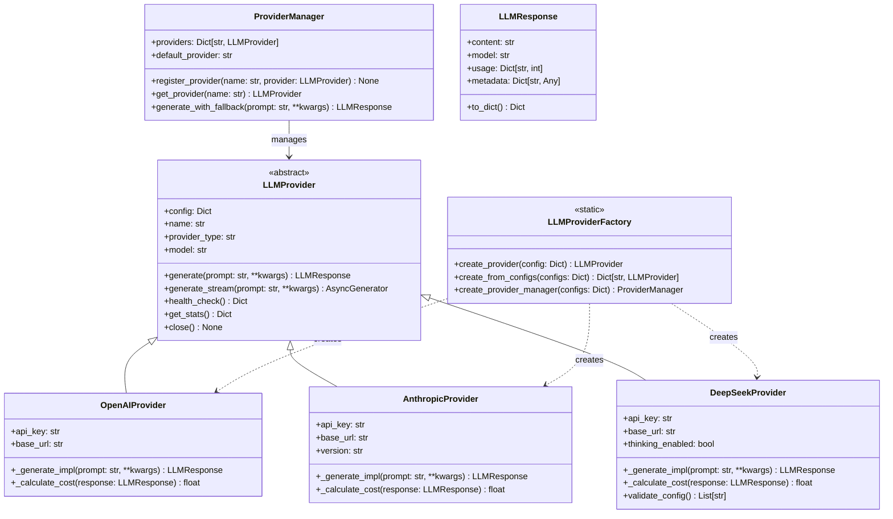
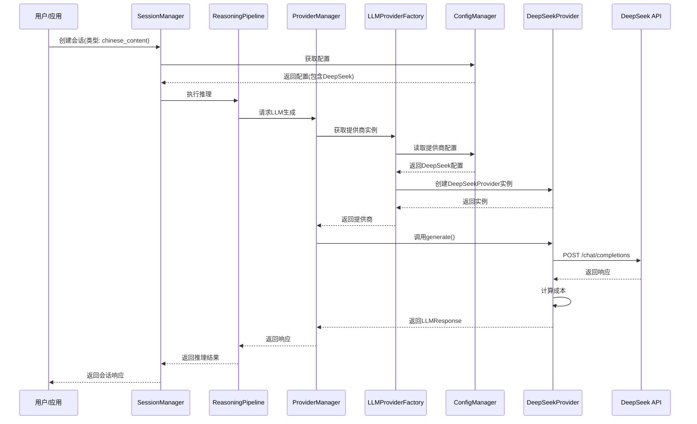
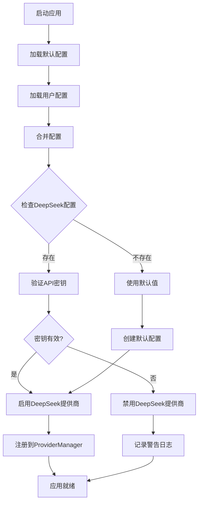
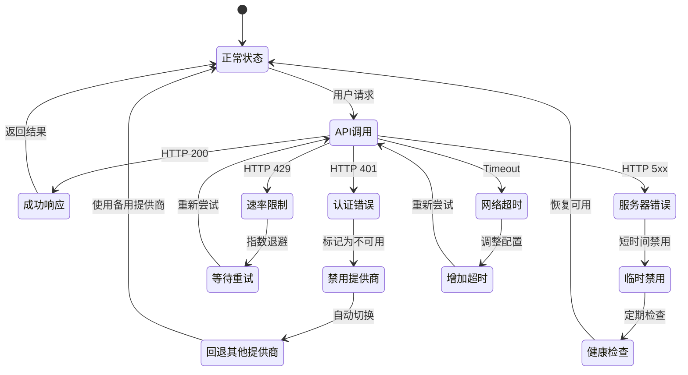
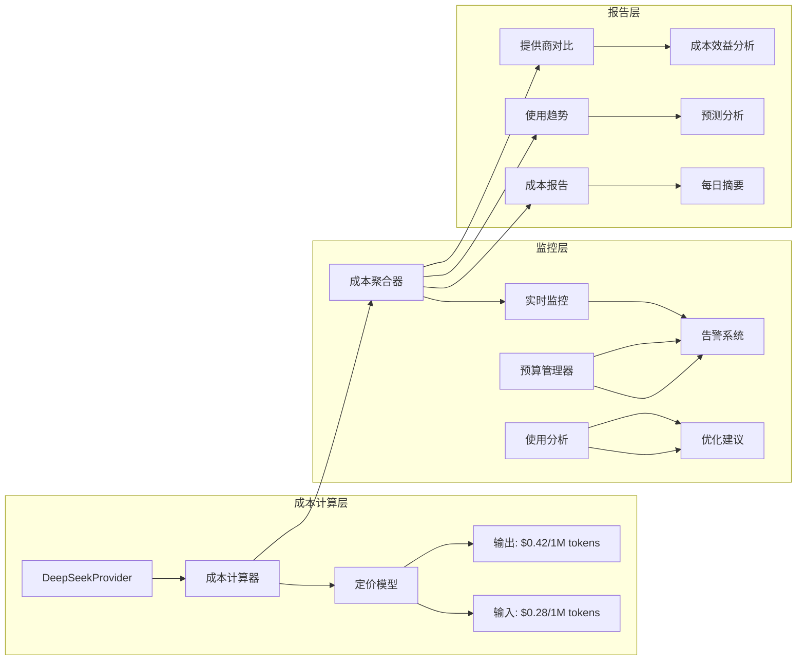
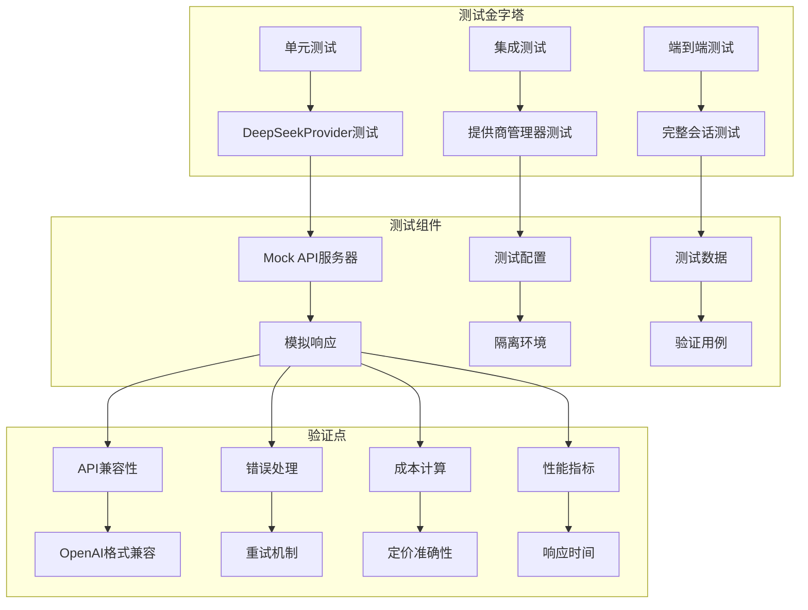

# DeepSeek API 集成架构图

## 系统架构概览



## 类关系图



## 数据流图



## 配置加载流程



## 错误处理流程



## 成本监控架构



## 集成测试架构



## 部署阶段图

```mermaid
timeline
    title DeepSeek集成部署时间线
    section 第1周: 核心实现
        实现DeepSeekProvider类
        添加提供商工厂支持
        基础单元测试

    section 第2周: 配置集成
        更新配置文件
        CLI命令集成
        集成测试

    section 第3周: 测试优化
        端到端测试
        性能测试
        文档更新

    section 第4周: 部署发布
        预发布环境
        金丝雀发布
        全面发布
```

---

## 关键设计决策

### 1. API兼容性设计
- **决策**: 采用OpenAI兼容的API格式
- **理由**: DeepSeek API与OpenAI API高度兼容，减少适配成本
- **影响**: 可以利用现有的OpenAI SDK模式和测试用例

### 2. 成本计算模型
- **决策**: 实现精确的按token成本计算
- **理由**: DeepSeek采用独特的缓存命中/未命中定价
- **影响**: 需要特殊处理缓存token的成本计算

### 3. 错误处理策略
- **决策**: 实现多层错误处理和回退机制
- **理由**: DeepSeek服务可能在不同地区有不同可用性
- **影响**: 增加系统复杂性，但提高可靠性

### 4. 配置管理
- **决策**: 支持环境变量和配置文件双重配置
- **理由**: 符合现有系统的配置模式
- **影响**: 用户可以选择最方便的配置方式

### 5. 测试策略
- **决策**: 使用Mock API进行隔离测试
- **理由**: 避免测试时产生实际API成本
- **影响**: 需要维护Mock服务器和测试数据

---

## 技术规格总结

| 组件 | 规格 | 备注 |
|------|------|------|
| **API端点** | `https://api.deepseek.com/chat/completions` | 生产环境 |
| **认证方式** | Bearer Token | 与OpenAI相同 |
| **支持模型** | `deepseek-chat`, `deepseek-reasoner` | 128K上下文 |
| **定价模型** | $0.28/1M输入, $0.42/1M输出 | 缓存未命中价格 |
| **速率限制** | 无硬性限制 | 高流量时可能延迟 |
| **超时设置** | 默认60秒 | 可配置 |
| **重试策略** | 指数退避，最多3次 | 可配置 |
| **成本计算** | 基于实际token使用量 | 支持缓存命中统计 |

---

*图表最后更新: 2026-02-07*
*架构版本: 1.0*
