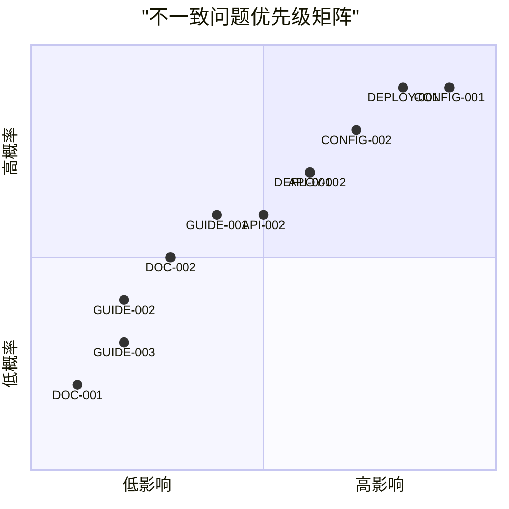

# LOOM 不一致问题分类和优先级分析

## 1. 问题严重程度评估标准

### 1.1 严重程度定义

| 等级 | 定义 | 影响范围 | 修复紧迫性 |
|------|------|----------|------------|
| **严重** | 导致系统无法正常工作或数据丢失 | 所有用户 | 立即修复（24小时内） |
| **高** | 核心功能受限或配置错误 | 大多数用户 | 短期修复（1周内） |
| **中** | 功能使用不便或文档不准确 | 部分用户 | 中期修复（1个月内） |
| **低** | 用户体验问题或文档不完整 | 少数用户 | 长期改进（3个月内） |

### 1.2 评估维度

1. **功能影响**: 问题是否影响核心功能
2. **用户影响**: 受影响的用户比例
3. **安全风险**: 是否存在安全漏洞
4. **数据风险**: 是否可能导致数据丢失
5. **修复成本**: 修复所需的时间和资源

## 2. 详细问题分类

### 2.1 严重问题（立即修复）

#### 2.1.1 CONFIG-001: 配置回退顺序错误
- **类别**: 配置一致性
- **影响**: 系统无法正常回退到备用 LLM Provider
- **风险**: 当主 Provider 故障时，系统可能完全不可用
- **根本原因**: 文档与配置文件中的 `fallback_order` 列表不一致
- **修复优先级**: P0（最高）

#### 2.1.2 DEPLOY-001: 环境文件命名错误
- **类别**: 部署一致性
- **影响**: 部署脚本无法加载正确的环境变量
- **风险**: 生产环境部署失败，服务不可用
- **根本原因**: 文档中的环境文件命名与脚本中的命名不一致
- **修复优先级**: P0（最高）

### 2.2 高优先级问题（1周内修复）

#### 2.2.1 CONFIG-002: 缺失的 Provider 配置
- **类别**: 配置完整性
- **影响**: 用户无法使用文档中提到的 Anthropic、Gemini 等 Provider
- **风险**: 功能宣传与实际能力不符，用户信任度下降
- **修复优先级**: P1

#### 2.2.2 API-001: API 参数不一致
- **类别**: API 一致性
- **影响**: 开发者按文档调用 API 时参数错误
- **风险**: 第三方集成失败，开发者体验差
- **修复优先级**: P1

#### 2.2.3 DEPLOY-002: Compose 文件命名问题
- **类别**: 部署一致性
- **影响**: 部署脚本找不到正确的 Docker Compose 文件
- **风险**: 多环境部署流程中断
- **修复优先级**: P1

### 2.3 中优先级问题（1个月内修复）

#### 2.3.1 API-002: API 端点路径问题
- **类别**: API 一致性
- **影响**: API 客户端调用可能失败
- **风险**: 影响自动化工具和集成
- **修复优先级**: P2

#### 2.3.2 GUIDE-001: CLI 命令文档不完整
- **类别**: 用户文档完整性
- **影响**: 用户无法使用所有 CLI 功能
- **风险**: 功能利用率低，技术支持负担增加
- **修复优先级**: P2

#### 2.3.3 DOC-002: 缺少扩展开发指南
- **类别**: 开发者文档完整性
- **影响**: 开发者无法创建插件和扩展
- **风险**: 限制生态系统发展
- **修复优先级**: P2

### 2.4 低优先级问题（3个月内改进）

#### 2.4.1 GUIDE-002: Web 界面文档过时
- **类别**: 用户文档准确性
- **影响**: 用户对 Web 界面功能有错误认知
- **风险**: 用户体验下降
- **修复优先级**: P3

#### 2.4.2 GUIDE-003: 规则示例不匹配
- **类别**: 示例文档准确性
- **影响**: 用户学习成本增加
- **风险**: 规则编写错误率增加
- **修复优先级**: P3

#### 2.4.3 DOC-001: 文档标记为"正在编写中"
- **类别**: 文档完整性
- **影响**: 项目显得不专业
- **风险**: 影响项目声誉
- **修复优先级**: P3

## 3. 问题类别分析

### 3.1 配置类问题（总计：3个）
- **严重**: 1个
- **高**: 1个
- **中**: 1个
- **低**: 0个

**分析**: 配置类问题影响最大，需要优先处理。配置错误可能导致系统完全不可用。

### 3.2 API 类问题（总计：3个）
- **严重**: 0个
- **高**: 1个
- **中**: 2个
- **低**: 0个

**分析**: API 问题主要影响开发者集成，虽然不直接影响最终用户，但对生态系统发展至关重要。

### 3.3 部署类问题（总计：3个）
- **严重**: 1个
- **高**: 1个
- **中**: 1个
- **低**: 0个

**分析**: 部署问题直接影响生产环境稳定性，需要高度重视。

### 3.4 文档类问题（总计：6个）
- **严重**: 0个
- **高**: 0个
- **中**: 1个
- **低**: 5个

**分析**: 文档问题数量最多，但严重程度相对较低。需要系统性的文档改进计划。

## 4. 优先级矩阵

## 5. 修复资源估算

### 5.1 立即修复（P0问题）
- **CONFIG-001**: 1人时
- **DEPLOY-001**: 2人时
- **总计**: 3人时（0.5人天）

### 5.2 短期修复（P1问题）
- **CONFIG-002**: 4人时
- **API-001**: 8人时
- **DEPLOY-002**: 4人时
- **总计**: 16人时（2人天）

### 5.3 中期修复（P2问题）
- **API-002**: 12人时
- **GUIDE-001**: 8人时
- **DOC-002**: 16人时
- **总计**: 36人时（4.5人天）

### 5.4 长期改进（P3问题）
- **GUIDE-002**: 8人时
- **GUIDE-003**: 12人时
- **DOC-001**: 20人时
- **总计**: 40人时（5人天）

### 5.5 总计资源需求
- **立即修复**: 3人时
- **短期修复**: 16人时
- **中期修复**: 36人时
- **长期改进**: 40人时
- **总计**: 95人时（约12人天）

## 6. 建议的修复顺序

### 阶段1: 立即修复（本周）
1. 修复 CONFIG-001（配置回退顺序）
2. 修复 DEPLOY-001（环境文件命名）
3. 验证修复效果

### 阶段2: 短期修复（第2周）
1. 修复 CONFIG-002（缺失 Provider 配置）
2. 修复 API-001（API 参数不一致）
3. 修复 DEPLOY-002（Compose 文件命名）

### 阶段3: 中期修复（第3-4周）
1. 修复 API-002（API 端点路径）
2. 完善 GUIDE-001（CLI 命令文档）
3. 创建 DOC-002（扩展开发指南）

### 阶段4: 长期改进（第2-3个月）
1. 更新 GUIDE-002（Web 界面文档）
2. 修正 GUIDE-003（规则示例）
3. 完成所有"正在编写中"文档

## 7. 质量保证措施

### 7.1 修复验证
1. **配置验证**: 自动化测试验证配置一致性
2. **API 验证**: 集成测试验证 API 文档准确性
3. **部署验证**: 实际部署测试验证部署文档准确性

### 7.2 预防措施
1. **文档审查**: 建立代码变更时的文档审查流程
2. **自动化检查**: 开发文档与代码一致性检查工具
3. **持续监控**: 建立文档质量监控机制

---

**分析完成时间**: 2026-02-08  
**分析范围**: 12个不一致问题  
**分析方法**: 影响分析、风险评估、资源估算  
**建议执行人**: 技术负责人、文档维护团队、质量保证团队