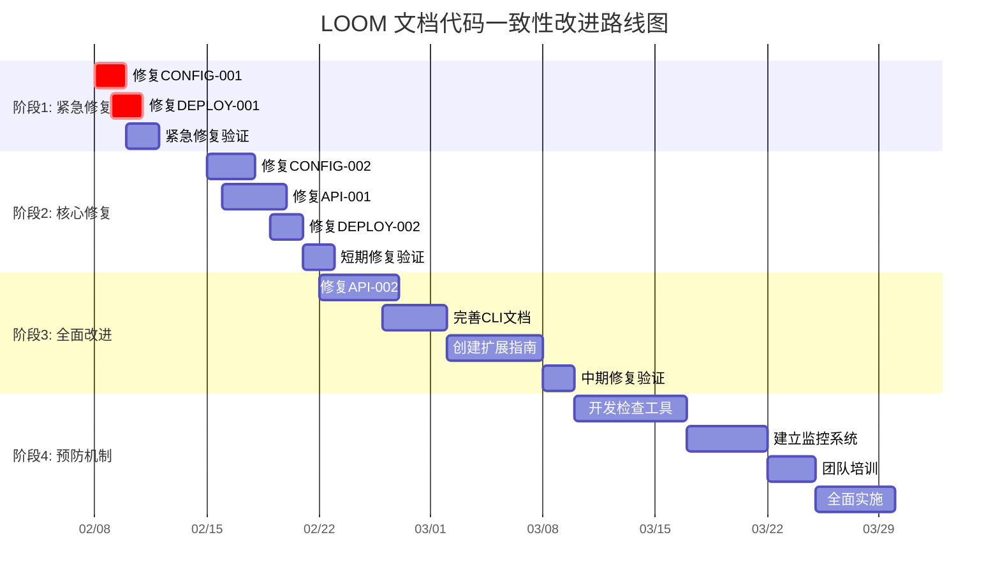

# LOOM 文档与代码一致性改进路线图

## 概述

本路线图详细描述了 LOOM 项目文档与代码一致性改进的完整执行计划，涵盖从问题修复到预防机制建立的全过程。路线图分为四个主要阶段，时间跨度为3个月。

## 路线图总览

## 阶段1：紧急修复（第1周：2026-02-08 至 2026-02-14）

### 1.1 目标
修复可能导致系统不可用或部署失败的严重问题。

### 1.2 关键里程碑
- **M1.1** (2026-02-09): 完成 CONFIG-001 修复
- **M1.2** (2026-02-11): 完成 DEPLOY-001 修复
- **M1.3** (2026-02-12): 完成紧急修复验证

### 1.3 详细任务

#### 第1-2天 (2026-02-08 至 2026-02-09)
- **任务**: 修复 CONFIG-001（配置回退顺序错误）
  - 对比文档和配置文件中的 `fallback_order`
  - 统一配置项，更新文档或配置文件
  - 添加配置验证测试
- **负责人**: 配置维护者
- **交付物**: 更新的配置文件、配置验证测试

#### 第3-4天 (2026-02-10 至 2026-02-11)
- **任务**: 修复 DEPLOY-001（环境文件命名错误）
  - 统一环境文件命名约定
  - 更新部署脚本和文档
  - 测试部署流程
- **负责人**: 部署工程师
- **交付物**: 更新的部署脚本、部署测试报告

#### 第5-6天 (2026-02-12 至 2026-02-13)
- **任务**: 紧急修复验证
  - 创建紧急修复测试套件
  - 验证所有修复效果
  - 生成修复验证报告
- **负责人**: 质量保证工程师
- **交付物**: 修复验证报告、测试套件

#### 第7天 (2026-02-14)
- **任务**: 阶段1总结和评审
  - 评审修复效果
  - 收集团队反馈
  - 规划阶段2工作
- **负责人**: 项目经理
- **交付物**: 阶段1总结报告

### 1.4 成功标准
- ✅ 所有严重不一致问题已修复
- ✅ 配置回退功能正常工作
- ✅ 部署流程无错误
- ✅ 修复验证测试通过率100%

## 阶段2：核心修复（第2周：2026-02-15 至 2026-02-21）

### 2.1 目标
修复影响核心功能和用户体验的高优先级问题。

### 2.2 关键里程碑
- **M2.1** (2026-02-17): 完成 CONFIG-002 修复
- **M2.2** (2026-02-19): 完成 API-001 修复
- **M2.3** (2026-02-20): 完成 DEPLOY-002 修复
- **M2.4** (2026-02-21): 完成短期修复验证

### 2.3 详细任务

#### 第8-10天 (2026-02-15 至 2026-02-17)
- **任务**: 修复 CONFIG-002（缺失的 Provider 配置）
  - 分析文档中提到的所有 LLM Provider
  - 添加缺失的 Provider 配置
  - 更新 Provider 选择策略文档
- **负责人**: 配置维护者
- **交付物**: 完整的 Provider 配置、更新的文档

#### 第11-13天 (2026-02-18 至 2026-02-20)
- **任务**: 修复 API-001（API 参数不一致）
  - 对比所有 API 文档和代码实现
  - 统一参数命名和类型
  - 创建 API 一致性测试
- **负责人**: API 开发工程师
- **交付物**: 一致的 API 文档、API 一致性测试

#### 第14天 (2026-02-21)
- **任务**: 修复 DEPLOY-002（Compose 文件命名问题）
  - 统一 Docker Compose 文件命名
  - 更新部署文档
  - 测试多环境部署
- **负责人**: 部署工程师
- **交付物**: 标准化的部署文件、部署文档

#### 第15天 (2026-02-22)
- **任务**: 短期修复验证
  - 扩展测试套件
  - 执行端到端测试
  - 生成质量报告
- **负责人**: 质量保证工程师
- **交付物**: 质量保证报告、扩展的测试套件

### 2.4 成功标准
- ✅ 所有高优先级问题已修复
- ✅ API 文档与代码一致性 >90%
- ✅ 多环境部署测试通过
- ✅ 端到端测试通过率 >95%

## 阶段3：全面改进（第3-4周：2026-02-22 至 2026-03-07）

### 3.1 目标
修复影响开发者体验和功能完整性的中优先级问题。

### 3.2 关键里程碑
- **M3.1** (2026-02-26): 完成 API-002 修复
- **M3.2** (2026-03-01): 完成 CLI 文档完善
- **M3.3** (2026-03-06): 完成扩展开发指南
- **M3.4** (2026-03-07): 完成中期修复验证

### 3.3 详细任务

#### 第16-20天 (2026-02-22 至 2026-02-26)
- **任务**: 修复 API-002（API 端点路径问题）
  - 审查所有 API 端点路径
  - 统一路径命名约定
  - 创建路径一致性检查工具
- **负责人**: API 开发工程师
- **交付物**: 一致的 API 端点、检查工具

#### 第21-24天 (2026-02-27 至 2026-03-01)
- **任务**: 完善 GUIDE-001（CLI 命令文档）
  - 分析所有 CLI 命令实现
  - 创建完整的 CLI 命令参考文档
  - 集成 CLI 帮助系统
- **负责人**: 技术文档工程师
- **交付物**: 完整的 CLI 文档、集成的帮助系统

#### 第25-29天 (2026-03-02 至 2026-03-06)
- **任务**: 创建 DOC-002（扩展开发指南）
  - 分析插件系统架构
  - 创建扩展开发指南
  - 提供插件开发示例
- **负责人**: 技术文档工程师
- **交付物**: 扩展开发指南、插件示例

#### 第30-31天 (2026-03-07 至 2026-03-08)
- **任务**: 中期修复验证
  - 创建开发者体验测试
  - 验证文档与代码一致性
  - 收集开发者反馈
- **负责人**: 质量保证工程师
- **交付物**: 开发者体验报告、一致性检查报告

### 3.4 成功标准
- ✅ 所有中优先级问题已修复
- ✅ 开发者体验评分 >4/5
- ✅ 文档与代码一致性 >95%
- ✅ 扩展开发指南完整可用

## 阶段4：预防机制（第5-8周：2026-03-08 至 2026-04-08）

### 4.1 目标
建立预防机制，防止未来出现不一致问题。

### 4.2 关键里程碑
- **M4.1** (2026-03-16): 完成检查工具开发
- **M4.2** (2026-03-21): 完成监控系统建立
- **M4.3** (2026-03-25): 完成团队培训
- **M4.4** (2026-04-08): 完成全面实施

### 4.3 详细任务

#### 第32-38天 (2026-03-08 至 2026-03-16)
- **任务**: 开发自动化检查工具
  - 开发文档代码一致性检查器
  - 开发文档影响分析工具
  - 集成到开发流程
- **负责人**: 工具开发工程师
- **交付物**: 自动化检查工具、流程集成

#### 第39-43天 (2026-03-17 至 2026-03-21)
- **任务**: 建立监控系统
  - 开发一致性监控仪表板
  - 建立定期报告机制
  - 设置问题预警系统
- **负责人**: 监控系统工程师
- **交付物**: 监控仪表板、报告系统

#### 第44-46天 (2026-03-22 至 2026-03-24)
- **任务**: 团队培训
  - 文档标准培训
  - 工具使用培训
  - 最佳实践分享
- **负责人**: 培训负责人
- **交付物**: 培训材料、培训记录

#### 第47-51天 (2026-03-25 至 2026-03-29)
- **任务**: 全面实施预防机制
  - 在所有项目中实施新流程
  - 启用自动化检查
  - 建立持续改进机制
- **负责人**: 项目经理
- **交付物**: 实施报告、改进机制

#### 第52-60天 (2026-03-30 至 2026-04-08)
- **任务**: 优化和巩固
  - 收集反馈并优化工具
  - 完善标准和流程
  - 建立文档优先文化
- **负责人**: 持续改进负责人
- **交付物**: 优化报告、文化评估

### 4.4 成功标准
- ✅ 自动化检查工具可用
- ✅ 监控系统正常运行
- ✅ 团队培训完成率100%
- ✅ 预防机制全面实施

## 资源分配计划

### 人员配置
| 阶段 | 配置维护者 | 部署工程师 | API工程师 | 文档工程师 | QA工程师 | 工具工程师 | 总计 |
|------|------------|------------|-----------|------------|----------|------------|------|
| 阶段1 | 1人时 | 2人时 | - | - | 2人时 | - | 5人时 |
| 阶段2 | 4人时 | 4人时 | 8人时 | - | 4人时 | - | 20人时 |
| 阶段3 | - | - | 12人时 | 24人时 | 8人时 | - | 44人时 |
| 阶段4 | - | - | - | - | - | 60人时 | 60人时 |
| **总计** | **5人时** | **6人时** | **20人时** | **24人时** | **14人时** | **60人时** | **129人时** |

### 时间分配
- **阶段1**: 1周（5个工作日）
- **阶段2**: 1周（5个工作日）
- **阶段3**: 2周（10个工作日）
- **阶段4**: 4周（20个工作日）
- **总计**: 8周（40个工作日）

## 沟通计划

### 定期会议
1. **每日站会** (15分钟)
   - 时间: 每天上午9:30
   - 内容: 进展同步、问题识别、当日计划
   - 参与: 所有相关团队成员

2. **每周评审** (1小时)
   - 时间: 每周五下午3:00
   - 内容: 本周进展、下周计划、风险识别
   - 参与: 项目经理、技术负责人、团队代表

3. **阶段总结** (2小时)
   - 时间: 每个阶段结束后
   - 内容: 阶段成果展示、经验总结、下一阶段规划
   - 参与: 所有利益相关者

### 沟通渠道
1. **项目看板**: 实时任务跟踪
2. **文档仓库**: 共享所有文档和报告
3. **团队聊天**: 日常沟通和协作
4. **邮件通知**: 重要更新和决策

## 风险管理计划

### 已识别风险
1. **资源冲突**: 与其他项目资源冲突
   - **概率**: 中
   - **影响**: 高
   - **缓解**: 提前协调资源，设置缓冲时间

2. **技术复杂性**: 工具开发比预期复杂
   - **概率**: 中
   - **影响**: 中
   - **缓解**: 采用渐进式开发，先实现核心功能

3. **团队抵触**: 开发者不接受新流程
   - **概率**: 低
   - **影响**: 中
   - **缓解**: 充分沟通价值，提供培训，简化流程

### 风险监控
- **每周风险评估**: 在每周评审中评估风险状态
- **风险登记册**: 维护所有识别风险的状态
- **应急预案**: 为高影响风险准备应急预案

## 成功指标和验收标准

### 量化指标
| 指标 | 阶段1目标 | 阶段2目标 | 阶段3目标 | 阶段4目标 |
|------|-----------|-----------|-----------|-----------|
| 一致性率 | 修复严重问题 | >90% | >95% | >98% |
| 测试通过率 | 100% | >95% | >95% | >98% |
| 问题数量 | 0严重问题 | <5高优先级 | <10中优先级 | <5所有级别 |
| 用户满意度 | - | - | >4/5 | >4.5/5 |

### 质量指标
1. **文档完整性**: 无缺失文档，无"正在编写中"标记
2. **示例可用性**: 所有示例都能正常运行
3. **工具可用性**: 自动化检查工具易于使用
4. **流程有效性**: 新流程被团队接受和使用

## 下一步行动

### 立即行动（本周）
1. 召开路线图启动会议
2. 分配阶段1具体任务
3. 建立项目看板和沟通渠道

### 短期行动（1个月内）
1. 完成阶段1和阶段2工作
2. 开始阶段3准备工作
3. 进行中期评估

### 长期行动（3个月内）
1. 完成所有阶段工作
2. 进行项目总结和评估
3. 制定持续改进计划

---

**路线图制定时间**: 2026-02-08  
**路线图版本**: 1.0  
**覆盖时间**: 2026-02-08 至 2026-04-08  
**审批状态**: 待技术负责人和产品负责人审批  
**更新频率**: 每两周评估和更新一次