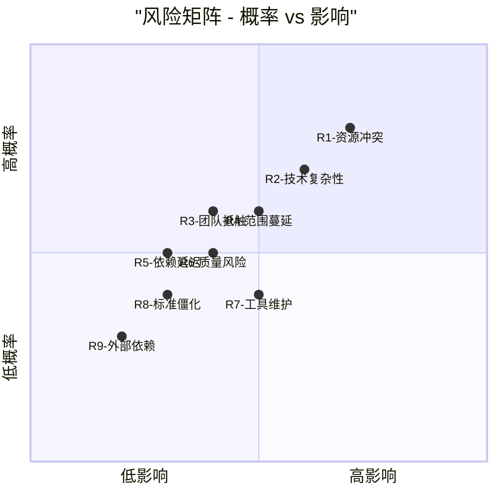

# LOOM 文档代码一致性改进项目风险评估

## 概述

本文档对 LOOM 文档与代码一致性改进项目进行全面的风险评估，识别潜在风险，评估风险影响，并制定相应的缓解措施。评估涵盖技术、流程、组织和外部四个维度。

## 1. 风险评估方法

### 1.1 评估标准

#### 风险概率等级
| 等级 | 概率范围 | 描述 |
|------|----------|------|
| **极高** | >80% | 几乎肯定发生 |
| **高** | 60-80% | 很可能发生 |
| **中** | 30-60% | 可能发生 |
| **低** | 10-30% | 不太可能发生 |
| **极低** | <10% | 几乎不可能发生 |

#### 风险影响等级
| 等级 | 影响描述 | 业务影响 | 时间影响 |
|------|----------|----------|----------|
| **灾难性** | 项目失败 | 重大业务损失 | >4周延迟 |
| **严重** | 重大范围变更 | 显著业务影响 | 2-4周延迟 |
| **中等** | 部分目标未达成 | 中等业务影响 | 1-2周延迟 |
| **轻微** | 小范围调整 | 轻微业务影响 | <1周延迟 |
| **可忽略** | 无实质影响 | 无业务影响 | 无延迟 |

### 1.2 风险矩阵

## 2. 详细风险评估

### 2.1 技术风险

#### R1: 技术复杂性风险
- **风险描述**: 自动化检查工具开发比预期复杂，技术挑战超出预期
- **概率**: 中 (60%)
- **影响**: 严重 (可能导致2-3周延迟)
- **根本原因**: 
  1. 文档与代码关联分析技术复杂
  2. 需要支持多种文档格式和代码语言
  3. 集成到现有开发流程需要深度修改
- **触发条件**: 
  1. 工具开发进度落后计划30%
  2. 关键技术问题无法在1周内解决
  3. 测试发现工具准确性不足

#### R2: 质量风险
- **风险描述**: 修复过程中引入新问题或回归问题
- **概率**: 中 (40%)
- **影响**: 中等 (可能导致1-2周延迟)
- **根本原因**:
  1. 文档更新可能引入错误信息
  2. 配置变更可能影响系统稳定性
  3. API 变更可能破坏现有集成
- **触发条件**:
  1. 修复后测试发现新问题
  2. 用户报告修复导致功能异常
  3. 自动化测试覆盖率不足

### 2.2 流程风险

#### R3: 范围蔓延风险
- **风险描述**: 修复过程中发现新问题，导致范围不断扩大
- **概率**: 中 (50%)
- **影响**: 中等 (可能导致1-2周延迟)
- **根本原因**:
  1. 初始检查可能不完整
  2. 修复过程中发现相关但未记录的问题
  3. 利益相关者提出新的改进要求
- **触发条件**:
  1. 每周发现超过3个新问题
  2. 项目范围变更请求超过2次
  3. 修复工作量超过初始估算20%

#### R4: 依赖延迟风险
- **风险描述**: 依赖的其他团队或组件延迟影响项目进度
- **概率**: 低 (30%)
- **影响**: 轻微 (可能导致<1周延迟)
- **根本原因**:
  1. API 团队无法及时提供接口信息
  2. 部署团队无法配合测试
  3. 文档团队资源冲突
- **触发条件**:
  1. 关键依赖延迟超过3天
  2. 依赖团队优先级变更
  3. 沟通不畅导致信息延迟

### 2.3 组织风险

#### R5: 资源冲突风险
- **风险描述**: 项目所需资源与其他项目冲突，资源不足
- **概率**: 高 (70%)
- **影响**: 严重 (可能导致2-4周延迟)
- **根本原因**:
  1. 团队成员同时参与多个项目
  2. 关键技能人员时间有限
  3. 工具开发需要专门技能
- **触发条件**:
  1. 关键人员可用时间低于计划50%
  2. 资源重新分配影响项目进度
  3. 技能缺口无法及时填补

#### R6: 团队抵触风险
- **风险描述**: 开发团队不接受新流程和工具，抵触变更
- **概率**: 低 (40%)
- **影响**: 中等 (可能导致1-2周延迟)
- **根本原因**:
  1. 新流程增加工作负担
  2. 工具使用学习曲线陡峭
  3. 文化抵触文档优先理念
- **触发条件**:
  1. 团队采用率低于50%
  2. 负面反馈超过正面反馈
  3. 工具使用率持续低下

### 2.4 运营风险

#### R7: 工具维护风险
- **风险描述**: 自动化工具本身需要持续维护，增加长期成本
- **概率**: 中 (50%)
- **影响**: 轻微 (增加维护成本)
- **根本原因**:
  1. 工具需要适应代码和文档变更
  2. 需要持续优化性能和准确性
  3. 需要技术支持和使用培训
- **触发条件**:
  1. 每月工具维护时间超过8小时
  2. 用户报告工具问题频率增加
  3. 工具无法适应新技术栈

#### R8: 标准僵化风险
- **风险描述**: 过于严格的标准限制创新和灵活性
- **概率**: 低 (30%)
- **影响**: 轻微 (可能影响开发效率)
- **根本原因**:
  1. 标准制定过于详细
  2. 缺乏灵活性和例外机制
  3. 标准更新流程繁琐
- **触发条件**:
  1. 开发者抱怨标准限制创新
  2. 标准例外请求频繁
  3. 标准更新滞后于技术发展

## 3. 风险缓解措施

### 3.1 技术风险缓解

#### R1缓解措施: 技术复杂性风险
1. **渐进式开发**: 先实现核心功能，再逐步增强
   - 第一阶段: 基础检查功能
   - 第二阶段: 增强分析和报告
   - 第三阶段: 高级功能和优化
2. **技术验证**: 提前进行技术可行性验证
   - 原型开发: 2周内完成可行性验证
   - 技术选型: 选择成熟稳定的技术栈
   - 专家咨询: 邀请领域专家参与设计
3. **缓冲时间**: 在计划中增加20%技术缓冲
   - 工具开发: 增加1周缓冲时间
   - 集成测试: 增加3天缓冲时间
   - 问题修复: 预留专门的问题修复时间

#### R2缓解措施: 质量风险
1. **加强测试**: 建立多层次测试体系
   - 单元测试: 覆盖所有修复代码
   - 集成测试: 验证文档与代码一致性
   - 回归测试: 确保无功能回归
2. **审查流程**: 建立严格的审查机制
   - 代码审查: 所有修复必须经过审查
   - 文档审查: 技术专家审查文档准确性
   - 用户验收: 关键用户验证修复效果
3. **监控机制**: 实施实时质量监控
   - 自动化监控: 实时检测不一致问题
   - 质量指标: 跟踪关键质量指标
   - 预警系统: 提前预警质量问题

### 3.2 流程风险缓解

#### R3缓解措施: 范围蔓延风险
1. **严格范围管理**: 明确项目边界
   - 范围文档: 明确定义包含和不包含的内容
   - 变更控制: 建立正式的变更控制流程
   - 优先级排序: 新问题按优先级纳入后续阶段
2. **定期范围审查**: 每周审查项目范围
   - 范围检查: 确认无范围蔓延
   - 变更评估: 评估变更请求的影响
   - 决策记录: 记录所有范围相关决策
3. **缓冲区管理**: 预留范围缓冲
   - 时间缓冲: 预留10%时间应对范围变更
   - 资源缓冲: 预留15%资源应对额外工作
   - 应急计划: 准备范围超出的应急方案

#### R4缓解措施: 依赖延迟风险
1. **依赖识别和管理**: 提前识别所有依赖
   - 依赖地图: 创建完整的依赖关系图
   - 接口协议: 提前定义清晰的接口协议
   - 备用方案: 为关键依赖准备备用方案
2. **主动沟通**: 建立定期沟通机制
   - 依赖方会议: 每周与依赖方同步进展
   - 状态报告: 定期分享项目状态
   - 问题预警: 提前预警可能的问题
3. **减少依赖**: 尽可能减少外部依赖
   - 自包含设计: 工具设计尽可能自包含
   - 松耦合集成: 使用松耦合的集成方式
   - 模拟和桩: 使用模拟减少实时依赖

### 3.3 组织风险缓解

#### R5缓解措施: 资源冲突风险
1. **资源保障**: 确保关键资源可用性
   - 资源承诺: 获得管理层资源承诺
   - 专用时间: 为关键人员安排专用时间
   - 备份资源: 识别和培训备份资源
2. **优先级管理**: 明确项目优先级
   - 优先级确认: 获得项目优先级确认
   - 冲突解决: 建立资源冲突解决机制
   - 灵活调整: 根据资源可用性灵活调整计划
3. **效率优化**: 提高资源使用效率
   - 工具支持: 提供高效的工具支持
   - 流程优化: 简化工作流程
   - 知识共享: 建立知识共享机制

#### R6缓解措施: 团队抵触风险
1. **沟通和价值展示**: 充分沟通项目价值
   - 价值说明: 清晰说明项目对团队的价值
   - 成功案例: 分享类似项目的成功案例
   - 定期更新: 定期分享项目进展和成果
2. **参与和所有权**: 让团队参与决策
   - 需求收集: 收集团队需求和反馈
   - 设计参与: 邀请团队参与工具设计
   - 试点项目: 选择志愿者团队进行试点
3. **培训和支持**: 提供充分培训和支持
   - 培训计划: 制定全面的培训计划
   - 使用支持: 提供工具使用支持
   - 反馈机制: 建立持续的反馈机制

### 3.4 运营风险缓解

#### R7缓解措施: 工具维护风险
1. **可持续设计**: 设计易于维护的工具
   - 模块化设计: 工具采用模块化设计
   - 文档完整: 提供完整的工具文档
   - 自动化测试: 建立工具自动化测试
2. **维护计划**: 制定明确的维护计划
   - 维护团队: 指定工具维护团队
   - 维护预算: 预留工具维护预算
   - 更新计划: 制定定期更新计划
3. **社区支持**: 建立社区支持机制
   - 用户社区: 建立用户社区分享经验
   - 贡献指南: 制定社区贡献指南
   - 问题跟踪: 建立公开的问题跟踪系统

#### R8缓解措施: 标准僵化风险
1. **灵活标准**: 设计灵活可调整的标准
   - 核心标准: 区分核心和可选标准
   - 例外机制: 建立合理的例外机制
   - 定期审查: 定期审查和更新标准
2. **反馈循环**: 建立持续的反馈循环
   - 标准反馈: 收集标准使用反馈
   - 改进建议: 鼓励提出改进建议
   - 快速响应: 对合理建议快速响应
3. **平衡管理**: 平衡一致性和灵活性
   - 风险平衡: 基于风险评估调整严格程度
   - 上下文感知: 根据上下文调整标准应用
   - 渐进实施: 渐进式实施标准

## 4. 风险监控计划

### 4.1 监控机制
1. **定期风险评估**: 每周进行风险评估
   - 时间: 每周五项目评审会议
   - 内容: 评估所有识别风险的状态
   - 输出: 更新风险登记册和风险矩阵

2. **关键指标监控**: 监控关键风险指标
   - 技术指标: 工具开发进度、测试通过率
   - 流程指标: 范围变更次数、依赖延迟时间
   - 组织指标: 资源可用性、团队采用率
   - 运营指标: 工具维护时间、标准例外次数

3. **预警系统**: 建立风险预警系统
   - 预警阈值: 为每个风险设置预警阈值
   - 预警通知: 自动发送预警通知
   - 应急响应: 触发应急响应流程

### 4.2 风险登记册
| 风险ID | 风险描述 | 概率 | 影响 | 状态 | 负责人 | 下次评估 |
|--------|----------|------|------|------|--------|----------|
| R1 | 技术复杂性风险 | 中 | 严重 | 活跃 | 技术负责人 | 2026-02-15 |
| R2 | 质量风险 | 中 | 中等 | 活跃 | 质量保证负责人 | 2026-02-15 |
| R3 | 范围蔓延风险 | 中 | 中等 | 活跃 | 项目经理 | 2026-02-15 |
| R4 | 依赖延迟风险 | 低 | 轻微 | 监控中 | 项目经理 | 2026-02-22 |
| R5 | 资源冲突风险 | 高 | 严重 | 活跃 | 资源经理 | 2026-02-15 |
| R6 | 团队抵触风险 | 低 | 中等 | 监控中 | 变更经理 | 2026-02-22 |
| R7 | 工具维护风险 | 中 | 轻微 | 监控中 | 工具维护负责人 | 2026-03-01 |
| R8 | 标准僵化风险 | 低 | 轻微 | 监控中 | 标准负责人 | 2026-03-01 |

### 4.3 应急计划
1. **高风险应急计划**: 为高影响风险准备应急计划
   - R1应急: 简化工具功能，延长时间线
   - R5应急: 调整项目范围，优先核心功能
   - 通用应急: 重新评估优先级，调整资源分配

2. **沟通计划**: 风险发生时的沟通计划
   - 内部沟通: 立即通知项目团队和利益相关者
   - 外部沟通: 根据影响范围决定外部沟通
   - 状态更新: 定期更新风险处理状态

3. **恢复计划**: 风险缓解后的恢复计划
   - 进度恢复: 制定追赶计划
   - 质量恢复: 加强测试和审查
   - 信心恢复: 通过小胜利重建团队信心

## 5. 风险应对策略总结

### 5.1 总体策略
1. **预防为主**: 通过良好设计和规划预防风险
2. **早期检测**: 建立早期预警系统及时检测风险
3. **快速响应**: 制定应急计划确保快速响应
4. **持续改进**: 从风险事件中学习并改进

### 5.2 关键成功因素
1. **管理层支持**: 获得充分的管理层支持和资源保障
2. **团队参与**: 确保团队充分参与和认同
3. **透明沟通**: 保持透明和及时的沟通
4. **灵活调整**: 根据实际情况灵活调整计划

### 5.3 建议行动
1. **立即行动**: 实施高优先级风险的缓解措施
2. **短期行动**: 建立风险监控和预警系统
3. **长期行动**: 建立风险管理文化和能力

---

**风险评估完成时间**: 2026-02-08  
**评估版本**: 1.0  
**评估范围**: 8个主要风险  
**评估方法**: 概率影响分析、专家判断、历史数据  
**建议审批**: 需要项目经理和技术负责人审批  
**下次评估**: 2026-02-15