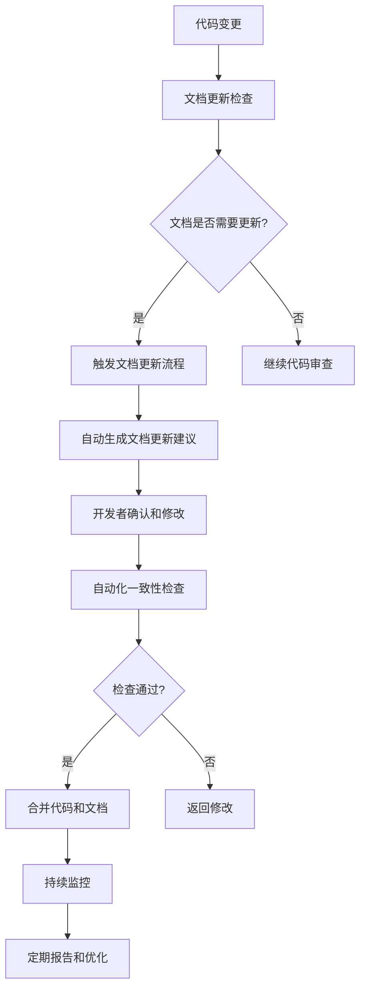

# LOOM 文档与代码一致性预防机制设计

## 概述

本设计文档描述了一个全面的预防机制，旨在防止 LOOM 项目中未来出现文档与代码不一致问题。该机制包括流程、工具、标准和监控四个层面。

## 1. 设计原则

### 1.1 核心原则
1. **文档即代码**: 将文档视为代码的一部分，纳入版本控制和 CI/CD 流程
2. **自动化优先**: 尽可能使用自动化工具检查和维护一致性
3. **预防为主**: 在问题发生前预防，而非事后修复
4. **持续改进**: 建立反馈循环，不断优化预防机制

### 1.2 设计目标
1. **零严重不一致**: 消除导致系统不可用的不一致问题
2. **高一致性率**: 文档与代码一致性 >95%
3. **低维护成本**: 自动化处理大部分一致性维护工作
4. **良好开发者体验**: 不增加过多开发负担

## 2. 预防机制架构



## 3. 流程设计

### 3.1 开发流程集成

#### 3.1.1 代码提交前检查
```yaml
pre-commit-hooks:
  - name: check-doc-consistency
    description: 检查代码变更是否影响文档
    command: scripts/check_doc_impact.py
    files: "\.(py|js|ts|java)$"
    fail_fast: true
```

#### 3.1.2 Pull Request 审查流程
1. **自动化检查**: PR 创建时自动运行一致性检查
2. **人工审查**: 审查者必须验证文档更新
3. **质量门禁**: 一致性检查不通过则阻止合并

#### 3.1.3 发布流程集成
1. **发布前检查**: 发布前运行完整的一致性检查
2. **文档生成**: 自动生成最新 API 文档
3. **版本同步**: 确保文档版本与代码版本一致

### 3.2 文档维护流程

#### 3.2.1 文档更新触发机制
- **代码注释变更**: 自动检测函数/类注释变更
- **API 变更**: 检测接口参数、返回值变更
- **配置变更**: 检测配置文件结构变更
- **功能变更**: 检测新功能或功能删除

#### 3.2.2 文档审查流程
1. **技术准确性审查**: 由相关开发者审查
2. **用户体验审查**: 由文档专家审查
3. **一致性审查**: 由自动化工具辅助

## 4. 工具设计

### 4.1 自动化检查工具

#### 4.1.1 文档代码一致性检查器 (`doc_consistency_checker.py`)
```python
class DocConsistencyChecker:
    """文档与代码一致性检查器"""
    
    def check_api_docs(self):
        """检查 API 文档与代码一致性"""
        # 1. 提取代码中的 API 定义
        # 2. 提取文档中的 API 描述
        # 3. 对比参数、返回值、示例
        # 4. 生成不一致报告
        
    def check_config_docs(self):
        """检查配置文档一致性"""
        # 1. 解析配置文件结构
        # 2. 解析配置文档
        # 3. 对比配置项和默认值
        # 4. 生成配置差异报告
        
    def check_cli_docs(self):
        """检查 CLI 文档一致性"""
        # 1. 解析 CLI 命令定义
        # 2. 解析 CLI 文档
        # 3. 对比命令、参数、选项
        # 4. 生成命令差异报告
```

#### 4.1.2 文档影响分析工具 (`doc_impact_analyzer.py`)
```python
class DocImpactAnalyzer:
    """文档影响分析工具"""
    
    def analyze_code_changes(self, diff):
        """分析代码变更对文档的影响"""
        # 1. 解析代码变更
        # 2. 识别可能影响文档的变更
        # 3. 推荐需要更新的文档
        # 4. 生成更新建议
        
    def suggest_doc_updates(self, changes):
        """生成文档更新建议"""
        # 1. 基于代码变更生成文档更新模板
        # 2. 提供具体的更新内容建议
        # 3. 标记必须更新和可选更新
```

### 4.2 文档生成工具

#### 4.2.1 API 文档自动生成器
- **输入**: 代码中的类型注解和文档字符串
- **输出**: 标准化的 API 参考文档
- **特性**: 支持多种输出格式（Markdown、HTML、OpenAPI）

#### 4.2.2 配置文档生成器
- **输入**: 配置文件结构和默认值
- **输出**: 配置参考文档
- **特性**: 自动生成配置示例和说明

### 4.3 监控和报告工具

#### 4.3.1 一致性监控仪表板
- **实时监控**: 显示当前一致性状态
- **趋势分析**: 展示一致性变化趋势
- **问题预警**: 提前预警可能的不一致问题

#### 4.3.2 定期报告生成器
- **周报**: 每周一致性状态报告
- **月报**: 月度趋势分析和改进建议
- **专项报告**: 针对特定问题的深入分析

## 5. 标准制定

### 5.1 文档质量标准

#### 5.1.1 完整性标准
```yaml
completeness_standards:
  api_docs:
    required_sections:
      - description: "功能描述"
      - parameters: "参数说明"
      - returns: "返回值说明"
      - examples: "使用示例"
      - errors: "可能错误"
    coverage_threshold: 95%
    
  config_docs:
    required_sections:
      - overview: "配置概述"
      - options: "所有配置项说明"
      - examples: "配置示例"
      - best_practices: "最佳实践"
    coverage_threshold: 100%
```

#### 5.1.2 准确性标准
- **技术准确性**: 文档内容必须与代码实现完全一致
- **时效性**: 文档必须反映最新代码状态
- **一致性**: 术语、格式、风格必须统一

### 5.2 代码注释标准

#### 5.2.1 文档字符串规范
```python
def create_session(world_name: str, character_name: str, 
                  scenario: str = "", rules: List[str] = None) -> Dict[str, Any]:
    """
    创建新会话
    
    Args:
        world_name: 世界名称，用于标识会话所属的世界
        character_name: 角色名称，会话中的主要角色
        scenario: 场景描述，可选的初始场景设置
        rules: 规则列表，可选的额外规则
        
    Returns:
        Dict[str, Any]: 包含会话ID和创建信息的字典
        
    Raises:
        ValidationError: 当输入参数无效时
        DatabaseError: 当数据库操作失败时
        
    Examples:
        >>> create_session("奇幻世界", "冒险者")
        {'session_id': 'abc123', 'status': 'created'}
    """
```

#### 5.2.2 类型注解要求
- **所有公共 API**: 必须有完整的类型注解
- **复杂类型**: 使用 TypedDict 或 dataclass 定义
- **可选参数**: 明确标注 Optional 类型

## 6. 实施计划

### 6.1 阶段1：基础工具开发（2周）
1. **开发核心检查工具**: 实现基本的文档代码一致性检查
2. **集成到开发流程**: 添加 pre-commit 钩子
3. **建立基本标准**: 制定文档和代码注释标准

### 6.2 阶段2：流程优化（2周）
1. **完善 PR 审查流程**: 集成自动化检查
2. **开发监控仪表板**: 实现实时监控
3. **建立报告机制**: 定期生成一致性报告

### 6.3 阶段3：高级功能（4周）
1. **开发智能分析工具**: 实现文档影响分析
2. **完善文档生成**: 自动生成 API 和配置文档
3. **建立反馈循环**: 收集用户反馈并优化

### 6.4 阶段4：持续改进（持续）
1. **优化工具性能**: 提高检查效率和准确性
2. **扩展检查范围**: 支持更多文档类型
3. **培养团队文化**: 建立文档优先的开发文化

## 7. 组织保障

### 7.1 角色和责任

#### 7.1.1 文档维护者
- **职责**: 负责文档质量和一致性
- **权限**: 批准文档更新，维护文档标准
- **技能**: 技术写作能力，熟悉项目架构

#### 7.1.2 开发团队
- **职责**: 编写准确的代码注释，及时更新文档
- **要求**: 遵守文档标准，参与文档审查
- **培训**: 接受文档编写和一致性检查培训

#### 7.1.3 质量保证团队
- **职责**: 监控一致性状态，验证修复效果
- **工具**: 使用监控仪表板和报告工具
- **指标**: 跟踪一致性指标和趋势

### 7.2 培训和培养

#### 7.2.1 培训计划
1. **文档标准培训**: 所有开发者必须参加
2. **工具使用培训**: 教授一致性检查工具使用方法
3. **最佳实践分享**: 定期分享文档编写经验

#### 7.2.2 文化建设
1. **文档优先文化**: 强调文档的重要性
2. **奖励机制**: 奖励文档贡献者
3. **持续改进**: 鼓励提出改进建议

## 8. 成功指标

### 8.1 量化指标
| 指标 | 目标值 | 测量方法 | 频率 |
|------|--------|----------|------|
| 文档代码一致性率 | >95% | 自动化检查 | 每日 |
| 严重不一致问题数 | 0 | 问题跟踪 | 每周 |
| 文档更新及时性 | <24小时 | 变更到更新时间 | 每周 |
| 开发者满意度 | >4/5 | 调查问卷 | 每月 |

### 8.2 质量指标
1. **文档完整性**: 所有功能都有对应文档
2. **示例可用性**: 所有示例都能正常运行
3. **用户反馈**: 用户问题中文档相关比例下降
4. **维护效率**: 文档维护时间占比合理

## 9. 风险管理

### 9.1 实施风险
1. **工具复杂性**: 工具过于复杂难以使用
   - **缓解**: 渐进式实施，提供详细文档
2. **团队抵触**: 开发者认为增加负担
   - **缓解**: 展示价值，提供培训，简化流程
3. **误报问题**: 工具产生大量误报
   - **缓解**: 持续优化算法，提供过滤选项

### 9.2 运营风险
1. **工具维护**: 工具本身需要持续维护
   - **缓解**: 分配专门维护资源，建立社区贡献
2. **标准僵化**: 标准过于严格限制创新
   - **缓解**: 定期审查和更新标准，保持灵活性
3. **依赖风险**: 过度依赖自动化工具
   - **缓解**: 保持人工审查环节，建立备份流程

## 10. 下一步行动

### 10.1 立即行动（本周）
1. 成立预防机制实施小组
2. 评审和批准本设计文档
3. 开始阶段1工具开发

### 10.2 短期行动（1个月内）
1. 完成基础工具开发
2. 进行团队培训
3. 开始试点实施

### 10.3 长期行动（3个月内）
1. 全面实施预防机制
2. 优化工具和流程
3. 建立持续改进文化

---

**设计完成时间**: 2026-02-08  
**设计版本**: 1.0  
**设计团队**: 架构组、文档组、质量保证组  
**审批要求**: 需要技术负责人和产品负责人审批